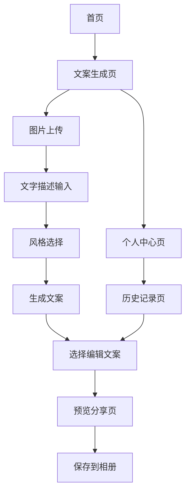

## 1. Product Overview
Shot&Share是一款专为微信用户设计的朋友圈文案生成小程序。用户可以通过上传图片和手动输入描述，结合系统推荐的风格和情感倾向，快速生成个性化的文案和配图，供用户分享到朋友圈或其他社交平台。

项目核心为简洁、现代的设计风格，并提供个性化的文案风格选择，增强社交分享体验。通过智能化的文案生成技术，帮助用户解决朋友圈文案创作困难的问题，提升社交分享的质量和效率。

## 2. Core Features

### 2.1 Feature Module
我们的Shot&Share小程序包含以下主要页面：
1. **首页**：功能介绍、快速入口、最近作品展示
2. **文案生成页**：图片上传、文字描述输入、风格选择、文案生成和展示
3. **个人中心页**：用户信息、统计数据、功能入口
4. **历史记录页**：文案历史管理、搜索筛选、编辑分享
5. **预览分享页**：合成图片预览、模板选择、保存分享

### 2.2 Page Details

| Page Name | Module Name | Feature description |
|-----------|-------------|---------------------|
| 首页 | 功能介绍区 | 展示小程序主要功能和特色，引导用户了解产品价值 |
| 首页 | 快速入口 | 提供"开始创作"按钮，快速跳转到文案生成页面 |
| 首页 | 最近作品 | 展示用户最近生成的3-5条文案，便于快速查看和重用 |
| 文案生成页 | 图片上传 | 支持拍照或从相册选择图片，作为文案生成的视觉输入 |
| 文案生成页 | 文字描述 | 多行文本输入框，用户可输入心情、场景、天气等描述信息 |
| 文案生成页 | 风格选择 | 提供8种文案风格选择：幽默沙雕、文艺治愈、旅行日记、情感心情、节日祝福、生活感悟、励志奋斗、社交互动 |
| 文案生成页 | 文案生成 | 结合图片识别、用户描述和风格选择，生成3-5条个性化文案 |
| 文案生成页 | 结果展示 | 展示生成的文案列表，每条文案包含选择、编辑、分享操作 |
| 个人中心页 | 用户信息 | 展示用户头像、昵称等基本信息 |
| 个人中心页 | 统计数据 | 显示总生成数、收藏数、分享数等使用统计 |
| 个人中心页 | 功能入口 | 提供历史记录、设置等功能的入口链接 |
| 历史记录页 | 搜索筛选 | 支持按关键词搜索和按风格、时间筛选历史文案 |
| 历史记录页 | 文案管理 | 展示历史文案列表，支持重新编辑、分享和删除操作 |
| 预览分享页 | 合成预览 | 将文案和图片合成为可分享的图片，提供实时预览 |
| 预览分享页 | 模板选择 | 提供多种布局模板，如九宫格、单图等不同排版方式 |
| 预览分享页 | 保存分享 | 支持保存合成图片到本地相册，便于分享到各社交平台 |

## 3. Core Process

用户使用Shot&Share的主要操作流程如下：

1. **进入小程序**：用户打开小程序，查看功能介绍，点击"开始创作"进入文案生成页
2. **上传图片**：用户选择拍照或从相册选择图片作为文案生成的基础
3. **输入描述**：用户在文字描述框中输入当前心情、场景描述等信息
4. **选择风格**：用户从8种预设风格中选择最符合当前需求的文案风格
5. **生成文案**：系统结合图片识别结果、用户描述和选择的风格，生成3-5条个性化文案
6. **选择文案**：用户浏览生成的文案，选择最满意的一条或进行编辑修改
7. **预览合成**：进入预览页面，查看文案和图片的合成效果，选择合适的布局模板
8. **保存分享**：将合成的图片保存到本地相册，便于分享到朋友圈或其他社交平台
9. **历史管理**：用户可在个人中心查看历史记录，重新使用或管理之前生成的文案

## 4. User Interface Design

### 4.1 Design Style
- **主色调**：黑白灰色系，营造简约高雅的视觉体验
- **强调色**：#2C2C2C（深灰），用于重要按钮和强调元素
- **背景色**：#FAFAFA（浅灰白），配合细腻的褶皱纹理背景
- **按钮样式**：圆角矩形按钮，简洁现代
- **字体**：标题16-20px加粗，正文14px常规，辅助文字12px细体
- **布局风格**：卡片式布局，大量留白，顶部导航
- **图标风格**：简约线性图标，与整体设计风格保持一致

### 4.2 Page Design Overview

| Page Name | Module Name | UI Elements |
|-----------|-------------|-------------|
| 首页 | 功能介绍区 | 简洁卡片布局，黑白配色，现代感字体，突出核心功能说明 |
| 首页 | 快速入口 | 大尺寸圆角按钮，深灰色背景#2C2C2C，白色文字，居中布局 |
| 首页 | 最近作品 | 横向滑动卡片，每个卡片包含缩略图和文案预览，简约边框 |
| 文案生成页 | 图片上传区 | 虚线边框的上传区域，支持点击和拖拽，包含相机和相册图标 |
| 文案生成页 | 文字输入框 | 多行文本框，圆角边框，浅灰背景，占位符文字引导输入 |
| 文案生成页 | 风格选择器 | 标签组布局，8个风格标签，选中状态为深灰背景，未选中为白色边框 |
| 文案生成页 | 文案结果 | 卡片列表布局，每个文案卡片包含内容和操作按钮，简洁分割线 |
| 个人中心页 | 用户信息 | 顶部用户卡片，头像+昵称布局，圆形头像，简约信息展示 |
| 个人中心页 | 统计卡片 | 网格布局的数据卡片，数字突出显示，配合简洁图标 |
| 历史记录页 | 搜索筛选 | 顶部搜索框+筛选标签，圆角输入框，标签式筛选按钮 |
| 历史记录页 | 文案列表 | 时间线式布局，每条记录包含时间、内容预览和操作按钮 |
| 预览分享页 | 合成预览 | 大尺寸预览区域，居中显示合成效果，支持缩放查看 |
| 预览分享页 | 模板选择 | 底部横向滑动的模板选择器，缩略图展示不同布局效果 |

### 4.3 Responsiveness
本小程序采用移动端优先设计，专为微信小程序环境优化。界面完全适配不同尺寸的手机屏幕，支持触摸交互优化，包括点击、滑动、长按等手势操作。所有交互元素都按照微信小程序设计规范进行适配，确保在各种设备上都能提供良好的用户体验。