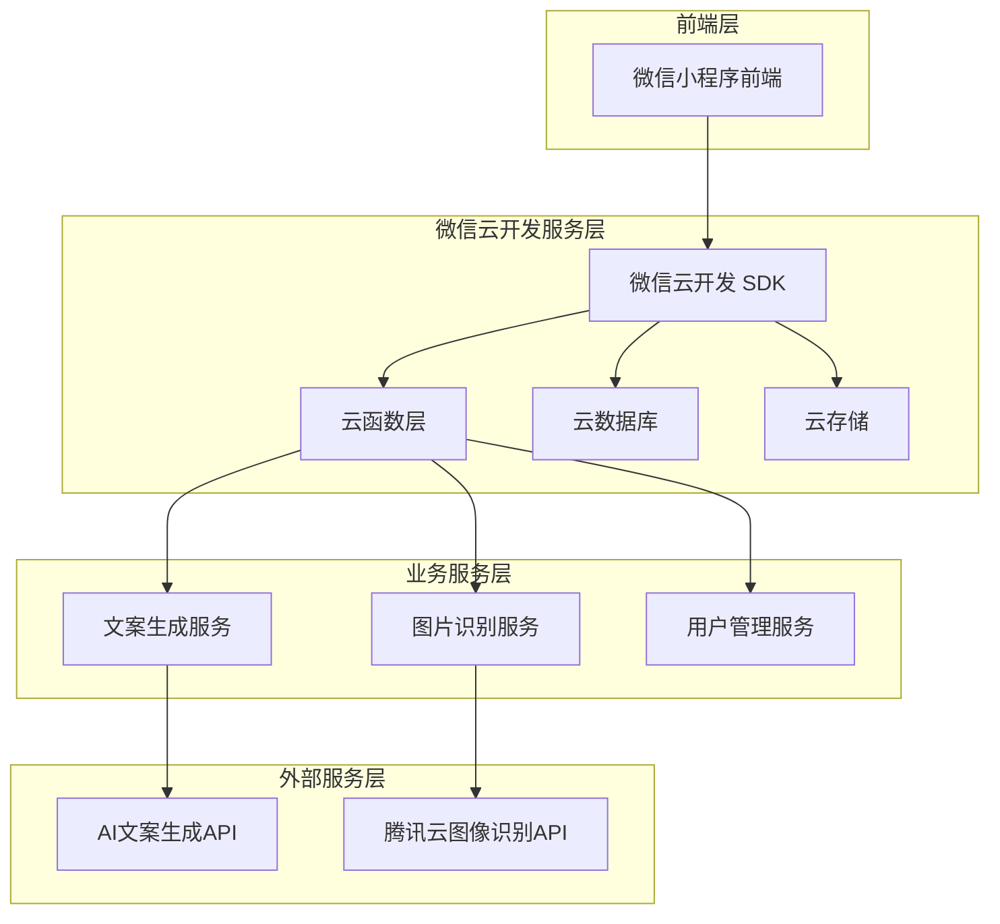
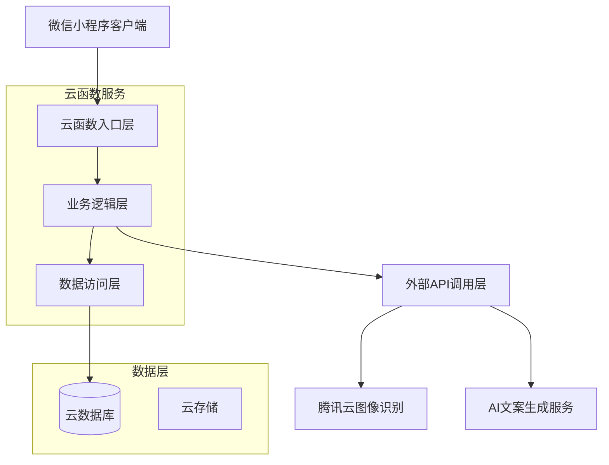
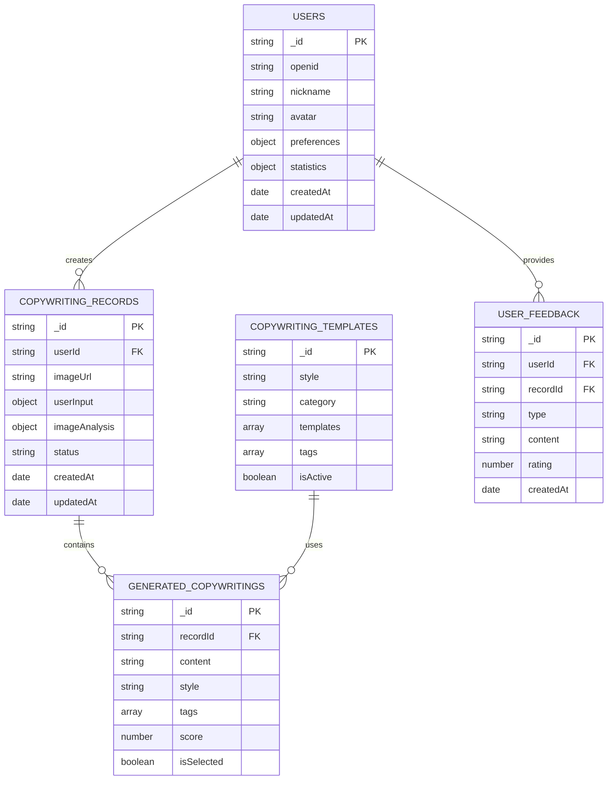

## 1.Architecture design



## 2.Technology Description

* Frontend: 微信小程序 + WXML + WXSS + JavaScript

* Backend: 微信云开发（云函数 Node.js）

* Database: 微信云数据库（MongoDB）

* Storage: 微信云存储

* External APIs: 腾讯云图像识别API + AI文案生成服务

## 3.Route definitions

| Route                    | Purpose                 |
| ------------------------ | ----------------------- |
| /pages/index/index       | 首页，展示功能介绍和快速入口          |
| /pages/generate/generate | 文案生成页，核心功能页面包含图片上传和文案生成 |
| /pages/profile/profile   | 个人中心页，用户信息和统计数据展示       |
| /pages/history/history   | 历史记录页，查看和管理历史生成的文案      |
| /pages/preview/preview   | 预览分享页，文案图片合成预览和分享功能     |

## 4.API definitions

### 4.1 Core API

用户认证相关

```
POST /api/auth/login
```

Request:

| Param Name | Param Type | isRequired | Description  |
| ---------- | ---------- | ---------- | ------------ |
| code       | string     | true       | 微信登录凭证       |
| userInfo   | object     | false      | 用户信息（昵称、头像等） |

Response:

| Param Name | Param Type | Description |
| ---------- | ---------- | ----------- |
| success    | boolean    | 登录是否成功      |
| openid     | string     | 用户唯一标识      |
| token      | string     | 访问令牌        |

Example

```json
{
  "code": "wx_login_code",
  "userInfo": {
    "nickName": "用户昵称",
    "avatarUrl": "头像URL"
  }
}
```

文案生成相关

```
POST /api/copywriting/generate
```

Request:

| Param Name  | Param Type | isRequired | Description |
| ----------- | ---------- | ---------- | ----------- |
| imageUrl    | string     | true       | 上传的图片URL    |
| description | string     | false      | 用户输入的文字描述   |
| style       | string     | true       | 选择的文案风格     |
| userId      | string     | true       | 用户ID        |

Response:

| Param Name   | Param Type | Description |
| ------------ | ---------- | ----------- |
| success      | boolean    | 生成是否成功      |
| copywritings | array      | 生成的文案列表     |
| recordId     | string     | 记录ID        |

Example

```json
{
  "imageUrl": "cloud://xxx.jpg",
  "description": "今天天气很好，心情不错",
  "style": "文艺治愈",
  "userId": "user123"
}
```

图片上传相关

```
POST /api/upload/image
```

Request:

| Param Name | Param Type | isRequired | Description |
| ---------- | ---------- | ---------- | ----------- |
| file       | file       | true       | 图片文件        |
| userId     | string     | true       | 用户ID        |

Response:

| Param Name | Param Type | Description  |
| ---------- | ---------- | ------------ |
| success    | boolean    | 上传是否成功       |
| imageUrl   | string     | 图片云存储URL     |
| imageInfo  | object     | 图片信息（尺寸、大小等） |

历史记录相关

```
GET /api/history/list
```

Request:

| Param Name | Param Type | isRequired | Description |
| ---------- | ---------- | ---------- | ----------- |
| userId     | string     | true       | 用户ID        |
| page       | number     | false      | 页码，默认1      |
| limit      | number     | false      | 每页数量，默认10   |
| style      | string     | false      | 筛选风格        |

Response:

| Param Name | Param Type | Description |
| ---------- | ---------- | ----------- |
| success    | boolean    | 请求是否成功      |
| records    | array      | 历史记录列表      |
| total      | number     | 总记录数        |

## 5.Server architecture diagram



## 6.Data model

### 6.1 Data model definition



### 6.2 Data Definition Language

用户表 (users)

```javascript
// 创建用户集合
db.createCollection('users')

// 创建索引
db.users.createIndex({ "openid": 1 }, { unique: true })
db.users.createIndex({ "createdAt": -1 })
db.users.createIndex({ "lastLoginAt": -1 })

// 初始化数据示例
db.users.insertOne({
  openid: "wx_openid_example",
  unionid: "wx_unionid_example",
  nickname: "示例用户",
  avatar: "https://example.com/avatar.jpg",
  gender: 0,
  city: "深圳",
  province: "广东",
  country: "中国",
  language: "zh_CN",
  preferences: {
    favoriteStyles: ["文艺治愈", "生活感悟"],
    defaultStyle: "文艺治愈",
    autoSave: true
  },
  statistics: {
    totalGenerated: 0,
    totalSaved: 0,
    totalShared: 0
  },
  createdAt: new Date(),
  updatedAt: new Date(),
  lastLoginAt: new Date()
})
```

文案记录表 (copywriting\_records)

```javascript
// 创建文案记录集合
db.createCollection('copywriting_records')

// 创建索引
db.copywriting_records.createIndex({ "userId": 1 })
db.copywriting_records.createIndex({ "createdAt": -1 })
db.copywriting_records.createIndex({ "status": 1 })
db.copywriting_records.createIndex({ "userInput.selectedStyle": 1 })

// 初始化数据示例
db.copywriting_records.insertOne({
  userId: "user_id_example",
  imageUrl: "cloud://shot-share.7368-shot-share/images/example.jpg",
  imageInfo: {
    width: 1080,
    height: 1920,
    size: 256000,
    format: "jpg"
  },
  userInput: {
    description: "今天天气很好，心情不错",
    selectedStyle: "文艺治愈",
    mood: "开心",
    scene: "户外"
  },
  imageAnalysis: {
    tags: ["天空", "云朵", "自然"],
    objects: ["天空", "云"],
    scene: "户外风景",
    colors: ["蓝色", "白色"],
    confidence: 0.95
  },
  generatedCopywriting: [
    {
      content: "蓝天白云，心情如天空般明朗",
      style: "文艺治愈",
      tags: ["#好天气", "#心情"],
      score: 0.9,
      isSelected: true
    }
  ],
  selectedCopywriting: {
    content: "蓝天白云，心情如天空般明朗",
    tags: ["#好天气", "#心情"],
    customEdits: ""
  },
  compositeImage: {
    url: "cloud://shot-share.7368-shot-share/composite/example.jpg",
    template: "simple",
    layout: "bottom-text"
  },
  actions: {
    isSaved: true,
    isShared: false,
    shareCount: 0,
    viewCount: 1
  },
  status: "completed",
  createdAt: new Date(),
  updatedAt: new Date()
})
```

文案模板表 (copywriting\_templates)

```javascript
// 创建文案模板集合
db.createCollection('copywriting_templates')

// 创建索引
db.copywriting_templates.createIndex({ "style": 1 })
db.copywriting_templates.createIndex({ "category": 1 })
db.copywriting_templates.createIndex({ "isActive": 1 })

// 初始化模板数据
db.copywriting_templates.insertMany([
  {
    style: "文艺治愈",
    category: "情感表达",
    templates: [
      {
        pattern: "{weather}，{mood}如{comparison}般{adjective}",
        variables: ["weather", "mood", "comparison", "adjective"],
        examples: ["阳光明媚，心情如花朵般绚烂"],
        weight: 1.0
      },
      {
        pattern: "在{scene}中，感受{feeling}的美好",
        variables: ["scene", "feeling"],
        examples: ["在午后阳光中，感受宁静的美好"],
        weight: 0.8
      }
    ],
    tags: ["治愈", "文艺", "情感"],
    isActive: true,
    createdAt: new Date(),
    updatedAt: new Date()
  },
  {
    style: "幽默沙雕",
    category: "娱乐搞笑",
    templates: [
      {
        pattern: "{action}的我，{result}，{emotion}",
        variables: ["action", "result", "emotion"],
        examples: ["拍照的我，角度找了半天，累成狗"],
        weight: 1.0
      }
    ],
    tags: ["搞笑", "幽默", "日常"],
    isActive: true,
    createdAt: new Date(),
    updatedAt: new Date()
  }
])
```

系统配置表 (system\_config)

```javascript
// 创建系统配置集合
db.createCollection('system_config')

// 创建索引
db.system_config.createIndex({ "key": 1 }, { unique: true })
db.system_config.createIndex({ "category": 1 })

// 初始化配置数据
db.system_config.insertMany([
  {
    key: "max_image_size",
    value: 5242880,
    description: "最大图片上传大小（字节）",
    category: "upload",
    isActive: true,
    createdAt: new Date(),
    updatedAt: new Date()
  },
  {
    key: "max_copywriting_count",
    value: 5,
    description: "单次生成文案最大数量",
    category: "generation",
    isActive: true,
    createdAt: new Date(),
    updatedAt: new Date()
  },
  {
    key: "supported_image_formats",
    value: ["jpg", "jpeg", "png", "webp"],
    description: "支持的图片格式",
    category: "upload",
    isActive: true,
    createdAt: new Date(),
    updatedAt: new Date()
  }
])
```

用户反馈表 (user\_feedback)

```javascript
// 创建用户反馈集合
db.createCollection('user_feedback')

// 创建索引
db.user_feedback.createIndex({ "userId": 1 })
db.user_feedback.createIndex({ "type": 1 })
db.user_feedback.createIndex({ "createdAt": -1 })
db.user_feedback.createIndex({ "status": 1 })
```

