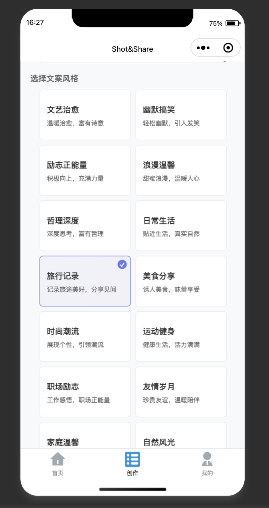

# Shot&Share - 智能朋友圈文案生成小程序

一个基于微信小程序和云开发的智能文案生成工具，帮助用户为图片生成个性化的朋友圈文案。

## 功能特性

### 🎨 多样化文案风格
- **文艺治愈** - 温暖治愈，富有诗意
- **幽默搞笑** - 轻松幽默，引人发笑
- **励志正能量** - 积极向上，充满力量
- **浪漫温馨** - 甜蜜浪漫，温暖人心
- **哲理深度** - 深度思考，富有哲理
- **日常生活** - 贴近生活，真实自然
- **旅行记录** - 记录旅途美好，分享见闻
- **美食分享** - 诱人美食，味蕾享受
- **时尚潮流** - 展现个性，引领潮流
- **运动健身** - 健康生活，活力满满
- **职场励志** - 工作感悟，职场正能量
- **友情岁月** - 珍贵友谊，温暖陪伴
- **家庭温馨** - 家的温暖，亲情无价
- **自然风光** - 大自然之美，心灵净化

### 📱 核心功能
- **智能文案生成** - 基于AI技术，为图片生成个性化文案
- **多图片支持** - 支持最多9张图片同时生成文案
- **历史记录** - 保存生成历史，支持筛选和排序
- **一键复制分享** - 快速复制文案到剪贴板
- **用户登录** - 微信授权登录，个人数据同步

## 📸 项目截图

### 图片选择界面


### 文案风格选择


### 文案生成结果


### 应用界面展示


## 技术栈

- **前端**: 微信小程序原生开发
- **后端**: 微信云开发
- **数据库**: 云数据库
- **AI服务**: 通义千问 Qwen-Omni API
- **存储**: 云存储

## 项目结构

```
Shot&Share/
├── miniprogram/              # 小程序前端代码
│   ├── pages/                # 页面文件
│   │   ├── index/           # 首页
│   │   ├── generate/        # 文案生成页
│   │   ├── history/         # 历史记录页
│   │   ├── preview/         # 预览页
│   │   └── profile/         # 个人中心页
│   ├── components/          # 组件
│   ├── images/             # 图片资源
│   ├── app.js              # 小程序入口
│   ├── app.json            # 小程序配置
│   └── app.wxss            # 全局样式
├── cloudfunctions/          # 云函数
│   ├── generateCopywriting/ # 文案生成云函数
│   ├── initDatabase/       # 数据库初始化
│   ├── login/              # 登录云函数
│   └── uploadImage/        # 图片上传云函数
└── project.config.json     # 项目配置
```

## 快速开始

### 环境要求
- 微信开发者工具
- Node.js 14+
- 微信小程序账号
- 微信云开发环境

### 安装部署

1. **克隆项目**
   ```bash
   git clone https://github.com/cnYui/ShotAndShare.git
   cd ShotAndShare
   ```

2. **配置小程序**
   - 在微信开发者工具中导入项目
   - 修改 `project.config.json` 中的 `appid`
   - 开通云开发环境

3. **部署云函数**
   - 右键点击 `cloudfunctions` 文件夹
   - 选择"上传并部署：云端安装依赖"
   - 依次部署所有云函数

4. **初始化数据库**
   - 调用 `initDatabase` 云函数初始化数据库集合

5. **配置API密钥**
   - 在 `generateCopywriting/index.js` 中配置通义千问API密钥

## 🗄️ 数据库设计

### 数据库概况


系统共包含6个主要数据集合，每个集合都有其特定的功能和用途：

### 1. copywriting_records 集合
**功能**: 存储用户生成的文案记录，是系统的核心数据表
```javascript
{
  _id: ObjectId,           // 记录唯一标识
  userId: String,          // 用户微信openid
  imageUrl: String,        // 主图片URL（向后兼容）
  imageUrls: Array,        // 多图片URL数组
  description: String,     // 用户输入的图片描述
  style: String,           // 选择的文案风格ID
  styleName: String,       // 文案风格名称
  content: String,         // 生成的文案内容
  tags: Array,            // 文案标签数组
  saved: Boolean,         // 是否已保存
  shared: Boolean,        // 是否已分享
  createdAt: Date,        // 创建时间
  updatedAt: Date         // 更新时间
}
```

### 2. users 集合
**功能**: 存储用户基本信息和统计数据
```javascript
{
  _id: ObjectId,           // 用户唯一标识
  openid: String,          // 微信用户openid
  nickName: String,        // 用户昵称
  avatarUrl: String,       // 用户头像URL
  gender: Number,          // 性别（0-未知，1-男，2-女）
  country: String,         // 国家
  province: String,        // 省份
  city: String,           // 城市
  language: String,        // 语言
  statistics: {            // 用户统计信息
    generated: Number,     // 总生成次数
    totalSaved: Number,    // 总保存次数
    totalShared: Number,   // 总分享次数
    totalCopied: Number    // 总复制次数
  },
  lastLoginAt: Date,       // 最后登录时间
  createdAt: Date,         // 注册时间
  updatedAt: Date          // 更新时间
}
```

### 3. copywriting_templates 集合
**功能**: 存储文案生成模板，支持不同风格的文案生成
```javascript
{
  _id: ObjectId,           // 模板唯一标识
  style: String,           // 文案风格ID
  name: String,            // 风格名称
  category: String,        // 分类（情感表达、娱乐搞笑等）
  templates: [{            // 模板列表
    pattern: String,       // 文案模板模式
    variables: [String],   // 可替换变量
    examples: [String],    // 示例文案
    weight: Number         // 权重（用于随机选择）
  }],
  tags: [String],          // 相关标签
  isActive: Boolean,       // 是否启用
  createdAt: Date,         // 创建时间
  updatedAt: Date          // 更新时间
}
```

### 4. system_config 集合
**功能**: 存储系统配置参数，便于动态调整系统行为
```javascript
{
  _id: ObjectId,           // 配置唯一标识
  key: String,             // 配置键名
  value: Mixed,            // 配置值（可以是数字、字符串、数组等）
  description: String,     // 配置描述
  category: String,        // 配置分类（upload、generation等）
  isActive: Boolean,       // 是否启用
  createdAt: Date,         // 创建时间
  updatedAt: Date          // 更新时间
}
```

### 5. user_feedback 集合
**功能**: 收集用户反馈，用于改进产品体验
```javascript
{
  _id: ObjectId,           // 反馈唯一标识
  userId: String,          // 用户ID
  recordId: ObjectId,      // 相关文案记录ID（可选）
  type: String,            // 反馈类型（like、dislike、report等）
  content: String,         // 反馈内容
  rating: Number,          // 评分（1-5）
  status: String,          // 处理状态（pending、processed）
  createdAt: Date          // 创建时间
}
```

### 6. upload_records 集合
**功能**: 记录图片上传历史，便于管理和统计
```javascript
{
  _id: ObjectId,           // 上传记录唯一标识
  userId: String,          // 用户ID
  fileId: String,          // 云存储文件ID
  fileName: String,        // 原始文件名
  fileSize: Number,        // 文件大小（字节）
  fileType: String,        // 文件类型
  uploadStatus: String,    // 上传状态（success、failed）
  createdAt: Date          // 上传时间
}
```

## 页面说明

### 首页 (index)
- 展示小程序介绍和主要功能
- 快速导航到文案生成页面

### 文案生成页 (generate)
- 图片选择和上传
- 文案风格选择
- 文案生成和结果展示
- 复制、保存、分享功能

### 历史记录页 (history)
- 查看历史生成记录
- 按风格筛选
- 按时间排序
- 删除记录功能

### 个人中心页 (profile)
- 用户登录/登出
- 个人统计信息
- 设置和帮助

## 配置说明

### API配置
在 `cloudfunctions/generateCopywriting/index.js` 中配置：
```javascript
const QWEN_API_KEY = 'your-api-key'
const QWEN_BASE_URL = 'https://dashscope.aliyuncs.com'
```

### 云环境配置
在 `miniprogram/app.js` 中配置：
```javascript
cloud.init({
  env: 'your-env-id'
})
```

## 贡献指南

1. Fork 本仓库
2. 创建特性分支 (`git checkout -b feature/AmazingFeature`)
3. 提交更改 (`git commit -m 'Add some AmazingFeature'`)
4. 推送到分支 (`git push origin feature/AmazingFeature`)
5. 打开 Pull Request

## 许可证

本项目采用 MIT 许可证 - 查看 [LICENSE](LICENSE) 文件了解详情

## 联系方式

- 项目链接: [https://github.com/cnYui/ShotAndShare](https://github.com/cnYui/ShotAndShare)
- 问题反馈: [Issues](https://github.com/cnYui/ShotAndShare/issues)

## 致谢

- 感谢微信小程序团队提供的开发平台
- 感谢阿里云通义千问提供的AI服务
- 感谢所有贡献者的支持

---

**Shot&Share** - 让每一张图片都有属于它的故事 📸✨