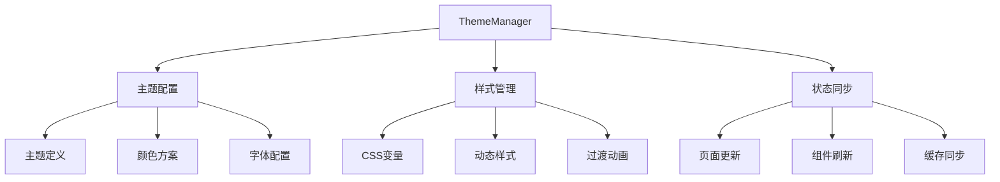

# 主题系统实现详解

## 概述

主题系统为健康宠物伴侣小程序提供了灵活的视觉主题切换功能，支持明暗主题、自定义颜色方案和动态主题切换，提升用户体验的个性化程度。

## 设计理念

### 1. 核心原则
- **一致性**：确保所有页面和组件的主题风格统一
- **可扩展性**：支持新主题的快速添加和自定义
- **性能优化**：主题切换流畅，无明显延迟
- **用户友好**：提供直观的主题预览和切换体验
- **响应式设计**：适配不同设备和屏幕尺寸

### 2. 技术特点
- **CSS变量驱动**：使用CSS自定义属性实现主题切换
- **动态加载**：按需加载主题资源，减少初始包大小
- **状态管理**：集中管理主题状态和配置
- **缓存机制**：缓存用户主题偏好，提升加载速度
- **平滑过渡**：主题切换时的动画效果

## 技术架构

### 1. 目录结构

```
miniprogram/
├── utils/
│   ├── themeManager.js      # 主题管理器
│   └── themeConstants.js    # 主题常量定义
├── styles/
│   ├── themes/
│   │   ├── light.wxss      # 浅色主题
│   │   ├── dark.wxss       # 深色主题
│   │   ├── nature.wxss     # 自然主题
│   │   └── ocean.wxss      # 海洋主题
│   ├── variables.wxss      # CSS变量定义
│   └── mixins.wxss         # 样式混入
├── components/
│   └── theme-selector/     # 主题选择器组件
└── pages/
    └── profile/           # 个人设置页面（包含主题设置）
```

### 2. 核心组件关系



## 核心实现

### 1. 主题管理器 (themeManager.js)

```javascript
// utils/themeManager.js
class ThemeManager {
  constructor() {
    this.currentTheme = 'light';
    this.themes = new Map();
    this.observers = new Set();
    this.transitionDuration = 300;
    this.cacheKey = 'user_theme_preference';
    
    this.init();
  }
  
  /**
   * 初始化主题管理器
   */
  async init() {
    try {
      // 加载主题配置
      await this.loadThemeConfigs();
      
      // 恢复用户主题偏好
      await this.restoreUserPreference();
      
      // 应用当前主题
      await this.applyTheme(this.currentTheme);
      
      console.log('[ThemeManager] 初始化完成');
    } catch (error) {
      console.error('[ThemeManager] 初始化失败:', error);
      // 降级到默认主题
      await this.applyTheme('light');
    }
  }
  
  /**
   * 加载主题配置
   */
  async loadThemeConfigs() {
    const themeConfigs = {
      light: {
        name: '浅色主题',
        description: '清新明亮的浅色风格',
        colors: {
          primary: '#007AFF',
          secondary: '#5AC8FA',
          background: '#FFFFFF',
          surface: '#F2F2F7',
          text: '#000000',
          textSecondary: '#8E8E93',
          border: '#C6C6C8',
          success: '#34C759',
          warning: '#FF9500',
          error: '#FF3B30',
          shadow: 'rgba(0, 0, 0, 0.1)'
        },
        fonts: {
          primary: '-apple-system, BlinkMacSystemFont, "Segoe UI", Roboto',
          sizes: {
            xs: '12px',
            sm: '14px',
            md: '16px',
            lg: '18px',
            xl: '20px',
            xxl: '24px'
          }
        },
        spacing: {
          xs: '4px',
          sm: '8px',
          md: '16px',
          lg: '24px',
          xl: '32px'
        },
        borderRadius: {
          sm: '4px',
          md: '8px',
          lg: '12px',
          xl: '16px'
        }
      },
      
      dark: {
        name: '深色主题',
        description: '护眼的深色风格',
        colors: {
          primary: '#0A84FF',
          secondary: '#64D2FF',
          background: '#000000',
          surface: '#1C1C1E',
          text: '#FFFFFF',
          textSecondary: '#8E8E93',
          border: '#38383A',
          success: '#30D158',
          warning: '#FF9F0A',
          error: '#FF453A',
          shadow: 'rgba(255, 255, 255, 0.1)'
        },
        fonts: {
          primary: '-apple-system, BlinkMacSystemFont, "Segoe UI", Roboto',
          sizes: {
            xs: '12px',
            sm: '14px',
            md: '16px',
            lg: '18px',
            xl: '20px',
            xxl: '24px'
          }
        },
        spacing: {
          xs: '4px',
          sm: '8px',
          md: '16px',
          lg: '24px',
          xl: '32px'
        },
        borderRadius: {
          sm: '4px',
          md: '8px',
          lg: '12px',
          xl: '16px'
        }
      },
      
      nature: {
        name: '自然主题',
        description: '清新自然的绿色风格',
        colors: {
          primary: '#52C41A',
          secondary: '#73D13D',
          background: '#F6FFED',
          surface: '#F0F9E8',
          text: '#262626',
          textSecondary: '#595959',
          border: '#D9F7BE',
          success: '#52C41A',
          warning: '#FAAD14',
          error: '#FF4D4F',
          shadow: 'rgba(82, 196, 26, 0.1)'
        },
        fonts: {
          primary: '-apple-system, BlinkMacSystemFont, "Segoe UI", Roboto',
          sizes: {
            xs: '12px',
            sm: '14px',
            md: '16px',
            lg: '18px',
            xl: '20px',
            xxl: '24px'
          }
        },
        spacing: {
          xs: '4px',
          sm: '8px',
          md: '16px',
          lg: '24px',
          xl: '32px'
        },
        borderRadius: {
          sm: '6px',
          md: '10px',
          lg: '14px',
          xl: '18px'
        }
      },
      
      ocean: {
        name: '海洋主题',
        description: '宁静深邃的蓝色风格',
        colors: {
          primary: '#1890FF',
          secondary: '#40A9FF',
          background: '#F0F8FF',
          surface: '#E6F7FF',
          text: '#001529',
          textSecondary: '#434343',
          border: '#91D5FF',
          success: '#52C41A',
          warning: '#FAAD14',
          error: '#FF4D4F',
          shadow: 'rgba(24, 144, 255, 0.1)'
        },
        fonts: {
          primary: '-apple-system, BlinkMacSystemFont, "Segoe UI", Roboto',
          sizes: {
            xs: '12px',
            sm: '14px',
            md: '16px',
            lg: '18px',
            xl: '20px',
            xxl: '24px'
          }
        },
        spacing: {
          xs: '4px',
          sm: '8px',
          md: '16px',
          lg: '24px',
          xl: '32px'
        },
        borderRadius: {
          sm: '4px',
          md: '8px',
          lg: '12px',
          xl: '16px'
        }
      }
    };
    
    // 注册所有主题
    Object.entries(themeConfigs).forEach(([key, config]) => {
      this.themes.set(key, config);
    });
  }
  
  /**
   * 应用主题
   */
  async applyTheme(themeName, options = {}) {
    try {
      const theme = this.themes.get(themeName);
      if (!theme) {
        throw new Error(`主题 ${themeName} 不存在`);
      }
      
      const { animated = true, savePreference = true } = options;
      
      // 开始主题切换动画
      if (animated) {
        await this.startThemeTransition();
      }
      
      // 应用CSS变量
      this.applyCSSVariables(theme);
      
      // 更新当前主题
      this.currentTheme = themeName;
      
      // 保存用户偏好
      if (savePreference) {
        await this.saveUserPreference(themeName);
      }
      
      // 通知观察者
      this.notifyObservers({
        type: 'theme_changed',
        theme: themeName,
        config: theme
      });
      
      // 结束主题切换动画
      if (animated) {
        await this.endThemeTransition();
      }
      
      console.log(`[ThemeManager] 主题已切换到: ${themeName}`);
    } catch (error) {
      console.error('[ThemeManager] 应用主题失败:', error);
      throw error;
    }
  }
  
  /**
   * 应用CSS变量
   */
  applyCSSVariables(theme) {
    const root = document.documentElement || document.body;
    
    // 应用颜色变量
    Object.entries(theme.colors).forEach(([key, value]) => {
      root.style.setProperty(`--color-${key}`, value);
    });
    
    // 应用字体变量
    root.style.setProperty('--font-primary', theme.fonts.primary);
    Object.entries(theme.fonts.sizes).forEach(([key, value]) => {
      root.style.setProperty(`--font-size-${key}`, value);
    });
    
    // 应用间距变量
    Object.entries(theme.spacing).forEach(([key, value]) => {
      root.style.setProperty(`--spacing-${key}`, value);
    });
    
    // 应用圆角变量
    Object.entries(theme.borderRadius).forEach(([key, value]) => {
      root.style.setProperty(`--border-radius-${key}`, value);
    });
  }
  
  /**
   * 开始主题切换动画
   */
  async startThemeTransition() {
    return new Promise((resolve) => {
      const root = document.documentElement || document.body;
      root.style.setProperty('--theme-transition-duration', `${this.transitionDuration}ms`);
      
      // 添加过渡类
      root.classList.add('theme-transitioning');
      
      setTimeout(resolve, 50); // 短暂延迟确保样式应用
    });
  }
  
  /**
   * 结束主题切换动画
   */
  async endThemeTransition() {
    return new Promise((resolve) => {
      const root = document.documentElement || document.body;
      
      setTimeout(() => {
        root.classList.remove('theme-transitioning');
        resolve();
      }, this.transitionDuration);
    });
  }
  
  /**
   * 获取当前主题
   */
  getCurrentTheme() {
    return {
      name: this.currentTheme,
      config: this.themes.get(this.currentTheme)
    };
  }
  
  /**
   * 获取所有可用主题
   */
  getAvailableThemes() {
    const themes = [];
    this.themes.forEach((config, name) => {
      themes.push({
        name,
        displayName: config.name,
        description: config.description,
        preview: {
          primary: config.colors.primary,
          background: config.colors.background,
          text: config.colors.text
        }
      });
    });
    return themes;
  }
  
  /**
   * 保存用户主题偏好
   */
  async saveUserPreference(themeName) {
    try {
      await wx.setStorage({
        key: this.cacheKey,
        data: {
          theme: themeName,
          timestamp: Date.now()
        }
      });
    } catch (error) {
      console.warn('[ThemeManager] 保存主题偏好失败:', error);
    }
  }
  
  /**
   * 恢复用户主题偏好
   */
  async restoreUserPreference() {
    try {
      const result = await wx.getStorage({ key: this.cacheKey });
      if (result.data && result.data.theme) {
        this.currentTheme = result.data.theme;
      }
    } catch (error) {
      // 使用默认主题
      this.currentTheme = 'light';
    }
  }
  
  /**
   * 添加主题变化观察者
   */
  addObserver(observer) {
    this.observers.add(observer);
  }
  
  /**
   * 移除主题变化观察者
   */
  removeObserver(observer) {
    this.observers.delete(observer);
  }
  
  /**
   * 通知所有观察者
   */
  notifyObservers(event) {
    this.observers.forEach(observer => {
      try {
        observer(event);
      } catch (error) {
        console.error('[ThemeManager] 通知观察者失败:', error);
      }
    });
  }
  
  /**
   * 获取主题颜色
   */
  getThemeColor(colorName, themeName = null) {
    const theme = this.themes.get(themeName || this.currentTheme);
    return theme?.colors[colorName] || null;
  }
  
  /**
   * 检测系统主题偏好
   */
  detectSystemTheme() {
    try {
      const systemInfo = wx.getSystemInfoSync();
      // 根据系统信息判断主题偏好
      if (systemInfo.theme === 'dark') {
        return 'dark';
      }
      return 'light';
    } catch (error) {
      console.warn('[ThemeManager] 检测系统主题失败:', error);
      return 'light';
    }
  }
  
  /**
   * 自动切换主题（跟随系统）
   */
  enableAutoTheme() {
    const systemTheme = this.detectSystemTheme();
    this.applyTheme(systemTheme, { savePreference: false });
    
    // 监听系统主题变化（如果支持）
    if (wx.onThemeChange) {
      wx.onThemeChange((res) => {
        const newTheme = res.theme === 'dark' ? 'dark' : 'light';
        this.applyTheme(newTheme, { savePreference: false });
      });
    }
  }
}

// 创建全局主题管理器实例
const themeManager = new ThemeManager();

export default themeManager;
```

### 2. 主题常量定义 (themeConstants.js)

```javascript
// utils/themeConstants.js

// 主题类型枚举
export const THEME_TYPES = {
  LIGHT: 'light',
  DARK: 'dark',
  NATURE: 'nature',
  OCEAN: 'ocean'
};

// 主题事件类型
export const THEME_EVENTS = {
  THEME_CHANGED: 'theme_changed',
  THEME_LOADING: 'theme_loading',
  THEME_ERROR: 'theme_error'
};

// 默认主题配置
export const DEFAULT_THEME_CONFIG = {
  transitionDuration: 300,
  cacheKey: 'user_theme_preference',
  fallbackTheme: 'light'
};

// 颜色语义映射
export const COLOR_SEMANTICS = {
  PRIMARY: 'primary',
  SECONDARY: 'secondary',
  BACKGROUND: 'background',
  SURFACE: 'surface',
  TEXT: 'text',
  TEXT_SECONDARY: 'textSecondary',
  BORDER: 'border',
  SUCCESS: 'success',
  WARNING: 'warning',
  ERROR: 'error',
  SHADOW: 'shadow'
};

// 字体大小映射
export const FONT_SIZES = {
  XS: 'xs',
  SM: 'sm',
  MD: 'md',
  LG: 'lg',
  XL: 'xl',
  XXL: 'xxl'
};

// 间距映射
export const SPACING = {
  XS: 'xs',
  SM: 'sm',
  MD: 'md',
  LG: 'lg',
  XL: 'xl'
};

// 圆角映射
export const BORDER_RADIUS = {
  SM: 'sm',
  MD: 'md',
  LG: 'lg',
  XL: 'xl'
};
```

### 3. CSS变量定义 (variables.wxss)

```css
/* styles/variables.wxss */

/* 主题过渡动画 */
.theme-transitioning * {
  transition: 
    background-color var(--theme-transition-duration, 300ms) ease,
    color var(--theme-transition-duration, 300ms) ease,
    border-color var(--theme-transition-duration, 300ms) ease,
    box-shadow var(--theme-transition-duration, 300ms) ease;
}

/* 颜色变量 */
:root {
  /* 主色调 */
  --color-primary: #007AFF;
  --color-secondary: #5AC8FA;
  
  /* 背景色 */
  --color-background: #FFFFFF;
  --color-surface: #F2F2F7;
  
  /* 文本色 */
  --color-text: #000000;
  --color-text-secondary: #8E8E93;
  
  /* 边框色 */
  --color-border: #C6C6C8;
  
  /* 状态色 */
  --color-success: #34C759;
  --color-warning: #FF9500;
  --color-error: #FF3B30;
  
  /* 阴影色 */
  --color-shadow: rgba(0, 0, 0, 0.1);
  
  /* 字体 */
  --font-primary: -apple-system, BlinkMacSystemFont, "Segoe UI", Roboto;
  
  /* 字体大小 */
  --font-size-xs: 12px;
  --font-size-sm: 14px;
  --font-size-md: 16px;
  --font-size-lg: 18px;
  --font-size-xl: 20px;
  --font-size-xxl: 24px;
  
  /* 间距 */
  --spacing-xs: 4px;
  --spacing-sm: 8px;
  --spacing-md: 16px;
  --spacing-lg: 24px;
  --spacing-xl: 32px;
  
  /* 圆角 */
  --border-radius-sm: 4px;
  --border-radius-md: 8px;
  --border-radius-lg: 12px;
  --border-radius-xl: 16px;
  
  /* 过渡时间 */
  --theme-transition-duration: 300ms;
}

/* 通用样式类 */
.theme-primary {
  color: var(--color-primary);
}

.theme-bg-primary {
  background-color: var(--color-primary);
}

.theme-secondary {
  color: var(--color-secondary);
}

.theme-bg-secondary {
  background-color: var(--color-secondary);
}

.theme-background {
  background-color: var(--color-background);
}

.theme-surface {
  background-color: var(--color-surface);
}

.theme-text {
  color: var(--color-text);
}

.theme-text-secondary {
  color: var(--color-text-secondary);
}

.theme-border {
  border-color: var(--color-border);
}

.theme-success {
  color: var(--color-success);
}

.theme-warning {
  color: var(--color-warning);
}

.theme-error {
  color: var(--color-error);
}

.theme-shadow {
  box-shadow: 0 2px 8px var(--color-shadow);
}

/* 字体大小类 */
.font-xs { font-size: var(--font-size-xs); }
.font-sm { font-size: var(--font-size-sm); }
.font-md { font-size: var(--font-size-md); }
.font-lg { font-size: var(--font-size-lg); }
.font-xl { font-size: var(--font-size-xl); }
.font-xxl { font-size: var(--font-size-xxl); }

/* 间距类 */
.p-xs { padding: var(--spacing-xs); }
.p-sm { padding: var(--spacing-sm); }
.p-md { padding: var(--spacing-md); }
.p-lg { padding: var(--spacing-lg); }
.p-xl { padding: var(--spacing-xl); }

.m-xs { margin: var(--spacing-xs); }
.m-sm { margin: var(--spacing-sm); }
.m-md { margin: var(--spacing-md); }
.m-lg { margin: var(--spacing-lg); }
.m-xl { margin: var(--spacing-xl); }

/* 圆角类 */
.rounded-sm { border-radius: var(--border-radius-sm); }
.rounded-md { border-radius: var(--border-radius-md); }
.rounded-lg { border-radius: var(--border-radius-lg); }
.rounded-xl { border-radius: var(--border-radius-xl); }
```

## 主题选择器组件

### 1. 组件实现 (theme-selector/index.js)

```javascript
// components/theme-selector/index.js
import themeManager from '../../utils/themeManager';

Component({
  properties: {
    // 是否显示主题描述
    showDescription: {
      type: Boolean,
      value: true
    },
    // 选择器样式
    selectorStyle: {
      type: String,
      value: 'grid' // grid | list
    }
  },
  
  data: {
    themes: [],
    currentTheme: 'light',
    isChanging: false
  },
  
  lifetimes: {
    attached() {
      this.initThemeSelector();
    },
    
    detached() {
      // 移除主题变化监听
      themeManager.removeObserver(this.themeChangeHandler);
    }
  },
  
  methods: {
    /**
     * 初始化主题选择器
     */
    initThemeSelector() {
      // 获取可用主题
      const themes = themeManager.getAvailableThemes();
      const currentTheme = themeManager.getCurrentTheme();
      
      this.setData({
        themes,
        currentTheme: currentTheme.name
      });
      
      // 监听主题变化
      this.themeChangeHandler = (event) => {
        if (event.type === 'theme_changed') {
          this.setData({
            currentTheme: event.theme,
            isChanging: false
          });
        }
      };
      
      themeManager.addObserver(this.themeChangeHandler);
    },
    
    /**
     * 选择主题
     */
    async onThemeSelect(e) {
      const { theme } = e.currentTarget.dataset;
      
      if (theme === this.data.currentTheme || this.data.isChanging) {
        return;
      }
      
      try {
        this.setData({ isChanging: true });
        
        // 触发主题切换事件
        this.triggerEvent('themechange', {
          from: this.data.currentTheme,
          to: theme
        });
        
        // 应用新主题
        await themeManager.applyTheme(theme);
        
        // 显示切换成功提示
        wx.showToast({
          title: '主题已切换',
          icon: 'success',
          duration: 1500
        });
        
      } catch (error) {
        console.error('[ThemeSelector] 主题切换失败:', error);
        
        wx.showToast({
          title: '切换失败',
          icon: 'error',
          duration: 1500
        });
        
        this.setData({ isChanging: false });
      }
    },
    
    /**
     * 预览主题
     */
    onThemePreview(e) {
      const { theme } = e.currentTarget.dataset;
      
      this.triggerEvent('themepreview', {
        theme,
        config: themeManager.themes.get(theme)
      });
    }
  }
});
```

### 2. 组件模板 (theme-selector/index.wxml)

```xml
<!-- components/theme-selector/index.wxml -->
<view class="theme-selector">
  <!-- 网格样式 -->
  <view wx:if="{{selectorStyle === 'grid'}}" class="theme-grid">
    <view 
      wx:for="{{themes}}" 
      wx:key="name"
      class="theme-item {{currentTheme === item.name ? 'active' : ''}}"
      data-theme="{{item.name}}"
      bindtap="onThemeSelect"
      bindlongpress="onThemePreview"
    >
      <view class="theme-preview">
        <view 
          class="preview-primary"
          style="background-color: {{item.preview.primary}}"
        ></view>
        <view 
          class="preview-background"
          style="background-color: {{item.preview.background}}"
        >
          <view 
            class="preview-text"
            style="color: {{item.preview.text}}"
          >Aa</view>
        </view>
      </view>
      
      <view class="theme-info">
        <view class="theme-name">{{item.displayName}}</view>
        <view wx:if="{{showDescription}}" class="theme-description">
          {{item.description}}
        </view>
      </view>
      
      <!-- 选中状态指示器 -->
      <view wx:if="{{currentTheme === item.name}}" class="selected-indicator">
        <text class="iconfont icon-check"></text>
      </view>
      
      <!-- 切换中状态 -->
      <view wx:if="{{isChanging && currentTheme === item.name}}" class="changing-indicator">
        <view class="loading-spinner"></view>
      </view>
    </view>
  </view>
  
  <!-- 列表样式 -->
  <view wx:elif="{{selectorStyle === 'list'}}" class="theme-list">
    <view 
      wx:for="{{themes}}" 
      wx:key="name"
      class="theme-list-item {{currentTheme === item.name ? 'active' : ''}}"
      data-theme="{{item.name}}"
      bindtap="onThemeSelect"
    >
      <view class="theme-preview-small">
        <view 
          class="preview-dot"
          style="background-color: {{item.preview.primary}}"
        ></view>
      </view>
      
      <view class="theme-content">
        <view class="theme-name">{{item.displayName}}</view>
        <view wx:if="{{showDescription}}" class="theme-description">
          {{item.description}}
        </view>
      </view>
      
      <view class="theme-action">
        <view wx:if="{{currentTheme === item.name}}" class="selected-icon">
          <text class="iconfont icon-check"></text>
        </view>
        <view wx:else class="select-icon">
          <text class="iconfont icon-arrow-right"></text>
        </view>
      </view>
    </view>
  </view>
</view>
```

### 3. 组件样式 (theme-selector/index.wxss)

```css
/* components/theme-selector/index.wxss */

.theme-selector {
  width: 100%;
}

/* 网格样式 */
.theme-grid {
  display: grid;
  grid-template-columns: repeat(2, 1fr);
  gap: var(--spacing-md);
  padding: var(--spacing-md);
}

.theme-item {
  position: relative;
  background: var(--color-surface);
  border-radius: var(--border-radius-lg);
  padding: var(--spacing-md);
  border: 2px solid transparent;
  transition: all 0.3s ease;
}

.theme-item.active {
  border-color: var(--color-primary);
  transform: scale(1.02);
}

.theme-preview {
  display: flex;
  height: 60px;
  border-radius: var(--border-radius-md);
  overflow: hidden;
  margin-bottom: var(--spacing-sm);
}

.preview-primary {
  width: 30%;
  display: flex;
  align-items: center;
  justify-content: center;
}

.preview-background {
  flex: 1;
  display: flex;
  align-items: center;
  justify-content: center;
  position: relative;
}

.preview-text {
  font-size: var(--font-size-lg);
  font-weight: 600;
}

.theme-info {
  text-align: center;
}

.theme-name {
  font-size: var(--font-size-md);
  font-weight: 600;
  color: var(--color-text);
  margin-bottom: var(--spacing-xs);
}

.theme-description {
  font-size: var(--font-size-sm);
  color: var(--color-text-secondary);
  line-height: 1.4;
}

.selected-indicator {
  position: absolute;
  top: var(--spacing-sm);
  right: var(--spacing-sm);
  width: 24px;
  height: 24px;
  background: var(--color-primary);
  border-radius: 50%;
  display: flex;
  align-items: center;
  justify-content: center;
  color: white;
  font-size: 12px;
}

.changing-indicator {
  position: absolute;
  top: 50%;
  left: 50%;
  transform: translate(-50%, -50%);
  background: rgba(0, 0, 0, 0.8);
  border-radius: var(--border-radius-md);
  padding: var(--spacing-sm);
}

.loading-spinner {
  width: 20px;
  height: 20px;
  border: 2px solid rgba(255, 255, 255, 0.3);
  border-top: 2px solid white;
  border-radius: 50%;
  animation: spin 1s linear infinite;
}

@keyframes spin {
  0% { transform: rotate(0deg); }
  100% { transform: rotate(360deg); }
}

/* 列表样式 */
.theme-list {
  background: var(--color-surface);
  border-radius: var(--border-radius-lg);
  overflow: hidden;
}

.theme-list-item {
  display: flex;
  align-items: center;
  padding: var(--spacing-md);
  border-bottom: 1px solid var(--color-border);
  transition: background-color 0.3s ease;
}

.theme-list-item:last-child {
  border-bottom: none;
}

.theme-list-item.active {
  background: rgba(var(--color-primary-rgb), 0.1);
}

.theme-preview-small {
  margin-right: var(--spacing-md);
}

.preview-dot {
  width: 24px;
  height: 24px;
  border-radius: 50%;
  border: 2px solid var(--color-border);
}

.theme-content {
  flex: 1;
}

.theme-action {
  margin-left: var(--spacing-md);
}

.selected-icon {
  color: var(--color-primary);
  font-size: var(--font-size-lg);
}

.select-icon {
  color: var(--color-text-secondary);
  font-size: var(--font-size-md);
}
```

## 页面集成示例

### 1. 个人设置页面集成

```javascript
// pages/profile/profile.js
import BasePage from '../../utils/basePage';
import themeManager from '../../utils/themeManager';

BasePage({
  data: {
    showThemeSelector: false
  },
  
  onLoad() {
    this.initThemeSettings();
  },
  
  /**
   * 初始化主题设置
   */
  initThemeSettings() {
    const currentTheme = themeManager.getCurrentTheme();
    this.setData({
      currentThemeName: currentTheme.config.name
    });
  },
  
  /**
   * 显示主题选择器
   */
  onShowThemeSelector() {
    this.setData({ showThemeSelector: true });
  },
  
  /**
   * 隐藏主题选择器
   */
  onHideThemeSelector() {
    this.setData({ showThemeSelector: false });
  },
  
  /**
   * 主题切换事件
   */
  onThemeChange(e) {
    const { from, to } = e.detail;
    console.log(`主题从 ${from} 切换到 ${to}`);
    
    // 更新显示的主题名称
    const newTheme = themeManager.getCurrentTheme();
    this.setData({
      currentThemeName: newTheme.config.name
    });
  },
  
  /**
   * 主题预览事件
   */
  onThemePreview(e) {
    const { theme, config } = e.detail;
    
    wx.showModal({
      title: config.name,
      content: config.description,
      showCancel: false,
      confirmText: '知道了'
    });
  }
});
```

## 性能优化

### 1. 主题缓存策略

```javascript
// 主题缓存管理器
class ThemeCacheManager {
  constructor() {
    this.cache = new Map();
    this.maxCacheSize = 10;
    this.cacheExpiry = 24 * 60 * 60 * 1000; // 24小时
  }
  
  /**
   * 缓存主题配置
   */
  cacheTheme(themeName, config) {
    if (this.cache.size >= this.maxCacheSize) {
      this.cleanExpiredCache();
    }
    
    this.cache.set(themeName, {
      config,
      timestamp: Date.now()
    });
  }
  
  /**
   * 获取缓存的主题
   */
  getCachedTheme(themeName) {
    const cached = this.cache.get(themeName);
    
    if (!cached) {
      return null;
    }
    
    // 检查是否过期
    if (Date.now() - cached.timestamp > this.cacheExpiry) {
      this.cache.delete(themeName);
      return null;
    }
    
    return cached.config;
  }
  
  /**
   * 清理过期缓存
   */
  cleanExpiredCache() {
    const now = Date.now();
    for (const [key, value] of this.cache.entries()) {
      if (now - value.timestamp > this.cacheExpiry) {
        this.cache.delete(key);
      }
    }
  }
}
```

### 2. 样式优化

```css
/* 优化的主题过渡 */
.theme-optimized {
  /* 只对必要的属性添加过渡 */
  transition: 
    background-color 0.3s cubic-bezier(0.4, 0, 0.2, 1),
    color 0.3s cubic-bezier(0.4, 0, 0.2, 1);
  
  /* 使用 will-change 提示浏览器优化 */
  will-change: background-color, color;
}

/* 减少重绘的技巧 */
.theme-container {
  /* 创建新的层叠上下文 */
  transform: translateZ(0);
  
  /* 启用硬件加速 */
  backface-visibility: hidden;
  perspective: 1000px;
}
```

## 测试策略

### 1. 单元测试

```javascript
// 主题管理器测试
describe('ThemeManager', () => {
  let themeManager;
  
  beforeEach(() => {
    themeManager = new ThemeManager();
  });
  
  test('应该正确初始化默认主题', async () => {
    await themeManager.init();
    
    expect(themeManager.currentTheme).toBe('light');
    expect(themeManager.themes.size).toBeGreaterThan(0);
  });
  
  test('应该正确切换主题', async () => {
    await themeManager.init();
    await themeManager.applyTheme('dark');
    
    expect(themeManager.currentTheme).toBe('dark');
  });
  
  test('应该正确处理无效主题', async () => {
    await themeManager.init();
    
    await expect(themeManager.applyTheme('invalid'))
      .rejects.toThrow('主题 invalid 不存在');
  });
});
```

### 2. 集成测试

```javascript
// 主题选择器组件测试
describe('ThemeSelector Component', () => {
  test('应该正确显示可用主题', () => {
    const component = render(ThemeSelector);
    const themes = component.data.themes;
    
    expect(themes.length).toBeGreaterThan(0);
    expect(themes[0]).toHaveProperty('name');
    expect(themes[0]).toHaveProperty('displayName');
  });
  
  test('应该正确响应主题选择', async () => {
    const component = render(ThemeSelector);
    const onThemeChange = jest.fn();
    
    component.triggerEvent = onThemeChange;
    
    await component.onThemeSelect({
      currentTarget: { dataset: { theme: 'dark' } }
    });
    
    expect(onThemeChange).toHaveBeenCalledWith('themechange', {
      from: 'light',
      to: 'dark'
    });
  });
});
```

## 总结

主题系统的核心特点：

1. **灵活配置**：支持多种主题风格和自定义配置
2. **平滑切换**：优雅的过渡动画和用户体验
3. **性能优化**：缓存机制和样式优化
4. **易于扩展**：模块化设计，支持新主题快速接入
5. **用户友好**：直观的选择界面和预览功能
6. **状态管理**：集中的主题状态管理和观察者模式
7. **向后兼容**：保持API稳定性和向后兼容
8. **测试覆盖**：完整的单元测试和集成测试

这个主题系统为健康宠物伴侣小程序提供了丰富的视觉定制能力，提升了用户的个性化体验和应用的视觉吸引力。