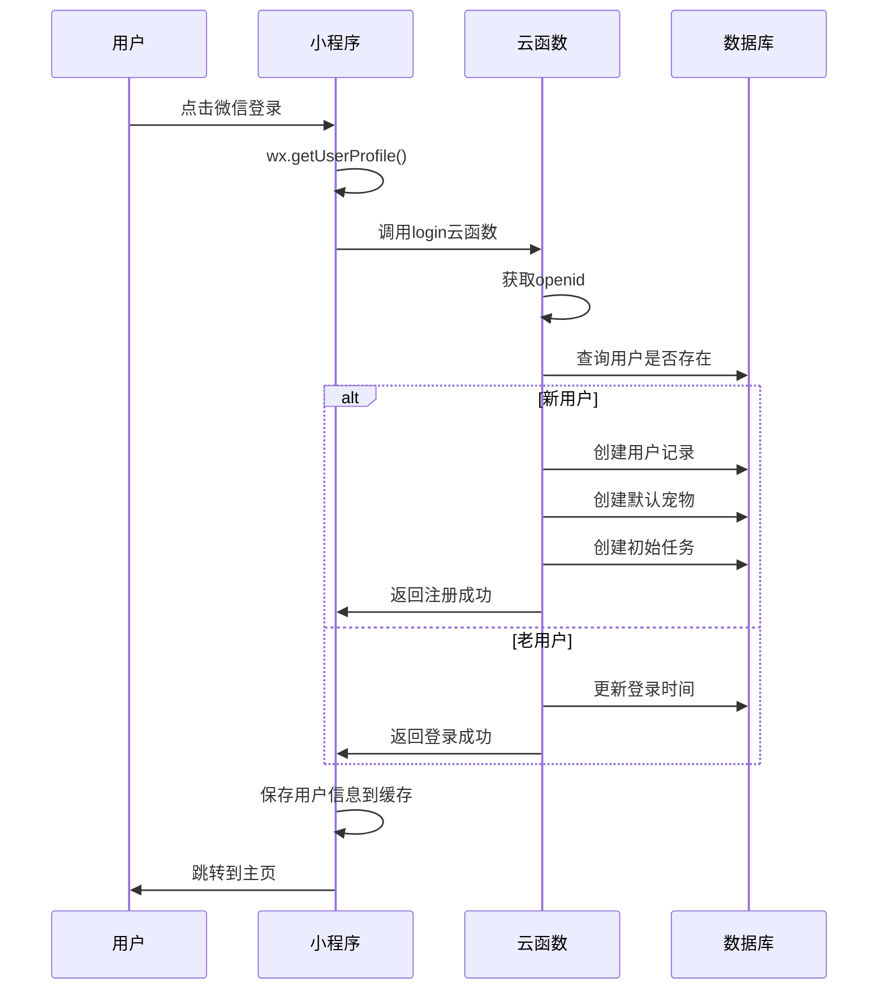
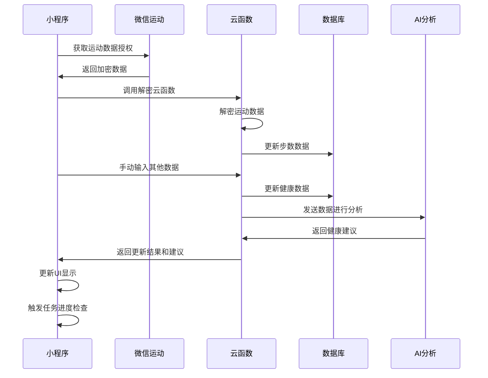
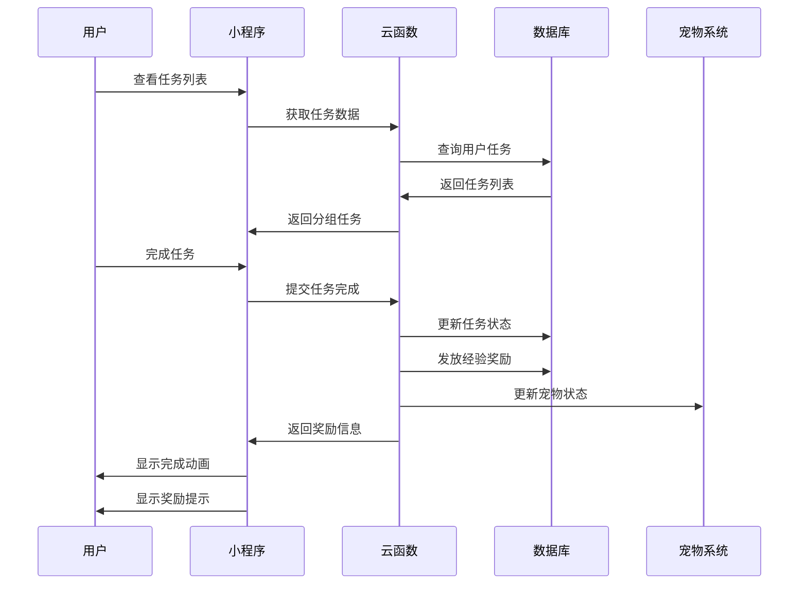
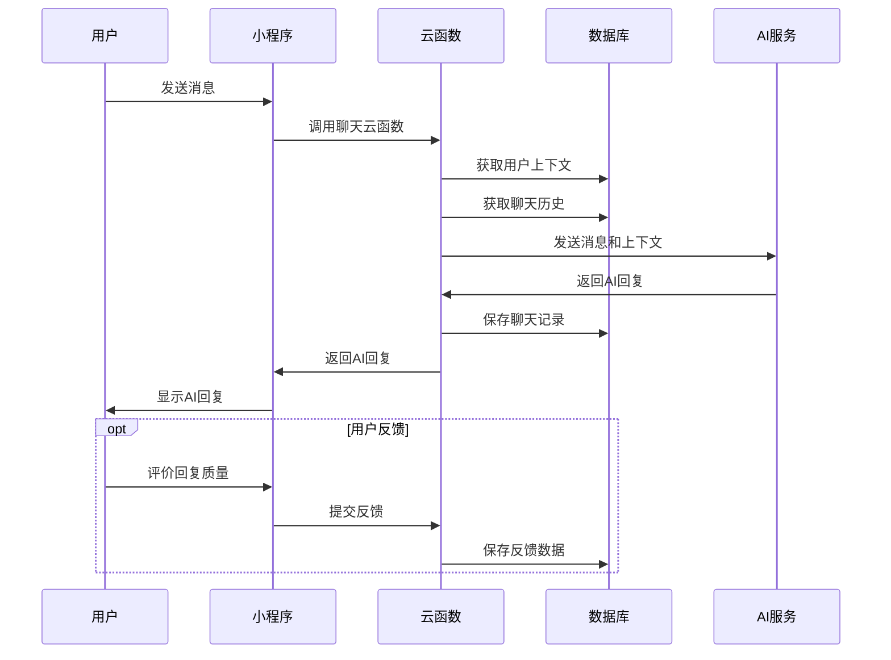

# 数据库设计与数据流

## 数据库架构概述

### 技术选型
- **数据库类型**：腾讯云开发 NoSQL 数据库
- **数据格式**：JSON 文档存储
- **索引策略**：基于查询频率的复合索引
- **权限控制**：基于用户 openid 的行级权限

### 数据库集合结构

```
Database: healthypetcompanion
├── users              # 用户信息表
├── pets               # 宠物信息表
├── healthData         # 健康数据表
├── tasks              # 任务表
├── chatHistory        # 聊天记录表
├── errorLogs          # 错误日志表
├── analytics          # 数据分析表
└── systemConfig       # 系统配置表
```

## 详细数据模型设计

### 1. 用户信息表 (users)

#### 数据结构

```javascript
{
  _id: ObjectId,                    // 系统生成的唯一ID
  openid: String,                   // 微信用户唯一标识 [索引]
  appid: String,                    // 小程序AppID
  unionid: String,                  // 微信开放平台UnionID
  
  // 基本信息
  nickname: String,                 // 用户昵称
  avatar: String,                   // 头像URL
  signature: String,                // 个性签名
  gender: Number,                   // 性别 0-未知 1-男 2-女
  
  // 等级系统
  level: Number,                    // 用户等级
  experience: Number,               // 经验值
  totalDays: Number,                // 陪伴天数
  totalTasks: Number,               // 完成任务总数
  
  // 用户设置
  settings: {
    theme: String,                  // 主题设置 auto/light/dark
    language: String,               // 语言设置 zh-cn/zh-tw/en
    notifications: {
      taskReminder: Boolean,        // 任务提醒
      waterReminder: Boolean,       // 饮水提醒
      sleepReminder: Boolean,       // 睡眠提醒
      reminderTime: {
        water: [String],            // 饮水提醒时间 ["09:00", "15:00", "21:00"]
        sleep: String,              // 睡眠提醒时间 "22:00"
        task: String                // 任务提醒时间 "08:00"
      }
    },
    privacy: {
      dataSync: Boolean,            // 数据同步开关
      shareData: Boolean,           // 数据分享开关
      publicProfile: Boolean        // 公开资料开关
    }
  },
  
  // 时间戳
  createTime: Date,                 // 创建时间 [索引]
  updateTime: Date,                 // 更新时间
  lastLoginTime: Date,              // 最后登录时间 [索引]
  lastActiveTime: Date              // 最后活跃时间
}
```

#### 索引设计

```javascript
// 主要索引
db.users.createIndex({ "openid": 1 }, { unique: true });
db.users.createIndex({ "createTime": -1 });
db.users.createIndex({ "lastLoginTime": -1 });
db.users.createIndex({ "level": -1, "experience": -1 });
```

#### 数据权限

```json
{
  "read": "auth != null && (auth.openid == resource.openid || resource.settings.privacy.publicProfile == true)",
  "write": "auth != null && auth.openid == resource.openid",
  "create": "auth != null",
  "delete": "auth != null && auth.openid == resource.openid"
}
```

### 2. 宠物信息表 (pets)

#### 数据结构

```javascript
{
  _id: ObjectId,                    // 系统生成的唯一ID
  userId: String,                   // 用户openid [索引]
  
  // 基本信息
  name: String,                     // 宠物名称
  type: String,                     // 宠物类型 plant/animal/virtual
  breed: String,                    // 品种
  avatar: String,                   // 宠物头像URL
  description: String,              // 宠物描述
  
  // 等级系统
  level: Number,                    // 宠物等级
  experience: Number,               // 经验值
  nextLevelExp: Number,             // 下一级所需经验
  
  // 属性值 (0-100)
  health: Number,                   // 健康值
  happiness: Number,                // 快乐值
  energy: Number,                   // 活力值
  intelligence: Number,             // 智力值
  
  // 状态信息
  mood: String,                     // 心情状态 veryHappy/happy/normal/needCare/sick
  status: String,                   // 当前状态 active/sleeping/playing/eating
  lastInteraction: Date,            // 最后互动时间
  
  // 成长记录
  growthHistory: [{
    date: Date,                     // 日期
    event: String,                  // 事件类型 levelUp/moodChange/statusChange
    description: String,            // 事件描述
    data: Object                    // 相关数据
  }],
  
  // 互动统计
  interactions: {
    feed: Number,                   // 喂食次数
    play: Number,                   // 玩耍次数
    exercise: Number,               // 运动次数
    rest: Number,                   // 休息次数
    total: Number                   // 总互动次数
  },
  
  // 时间戳
  createTime: Date,                 // 创建时间
  updateTime: Date,                 // 更新时间
  birthDate: Date                   // 生日
}
```

#### 索引设计

```javascript
db.pets.createIndex({ "userId": 1 });
db.pets.createIndex({ "level": -1, "experience": -1 });
db.pets.createIndex({ "createTime": -1 });
db.pets.createIndex({ "lastInteraction": -1 });
```

### 3. 健康数据表 (healthData)

#### 数据结构

```javascript
{
  _id: ObjectId,                    // 系统生成的唯一ID
  userId: String,                   // 用户openid [索引]
  date: String,                     // 日期 YYYY-MM-DD [索引]
  
  // 基础健康数据
  steps: Number,                    // 步数
  distance: Number,                 // 距离 (米)
  calories: Number,                 // 消耗卡路里
  
  // 饮水数据
  water: Number,                    // 饮水量 (毫升)
  waterRecords: [{
    time: Date,                     // 饮水时间
    amount: Number,                 // 饮水量
    type: String                    // 饮水类型 water/tea/coffee/juice
  }],
  
  // 睡眠数据
  sleep: Number,                    // 睡眠时长 (小时)
  sleepQuality: Number,             // 睡眠质量 1-5
  bedTime: Date,                    // 就寝时间
  wakeTime: Date,                   // 起床时间
  sleepStages: {
    deep: Number,                   // 深度睡眠时长
    light: Number,                  // 浅度睡眠时长
    rem: Number,                    // REM睡眠时长
    awake: Number                   // 清醒时长
  },
  
  // 运动数据
  exercise: Number,                 // 运动时长 (分钟)
  exerciseRecords: [{
    type: String,                   // 运动类型 running/walking/cycling/swimming
    duration: Number,               // 持续时间 (分钟)
    intensity: String,              // 强度 low/medium/high
    calories: Number,               // 消耗卡路里
    startTime: Date,                // 开始时间
    endTime: Date                   // 结束时间
  }],
  
  // 心率数据
  heartRate: {
    resting: Number,                // 静息心率
    average: Number,                // 平均心率
    max: Number,                    // 最大心率
    records: [{
      time: Date,                   // 测量时间
      value: Number,                // 心率值
      context: String               // 测量环境 rest/exercise/stress
    }]
  },
  
  // 体重体脂
  weight: Number,                   // 体重 (kg)
  bodyFat: Number,                  // 体脂率 (%)
  bmi: Number,                      // BMI指数
  
  // 情绪健康
  mood: {
    score: Number,                  // 情绪评分 1-10
    tags: [String],                 // 情绪标签 happy/sad/stressed/calm
    note: String                    // 情绪备注
  },
  
  // 数据来源
  dataSources: {
    steps: String,                  // 步数来源 werun/manual/device
    sleep: String,                  // 睡眠来源 manual/device
    heartRate: String,              // 心率来源 manual/device
    weight: String                  // 体重来源 manual/device
  },
  
  // 时间戳
  createTime: Date,                 // 创建时间
  updateTime: Date,                 // 更新时间
  syncTime: Date                    // 同步时间
}
```

#### 索引设计

```javascript
db.healthData.createIndex({ "userId": 1, "date": -1 }, { unique: true });
db.healthData.createIndex({ "date": -1 });
db.healthData.createIndex({ "createTime": -1 });
db.healthData.createIndex({ "userId": 1, "createTime": -1 });
```

### 4. 任务表 (tasks)

#### 数据结构

```javascript
{
  _id: ObjectId,                    // 系统生成的唯一ID
  userId: String,                   // 用户openid [索引]
  
  // 基本信息
  title: String,                    // 任务标题
  description: String,              // 任务描述
  icon: String,                     // 任务图标
  
  // 分类信息
  type: String,                     // 任务类型 daily/weekly/monthly/special
  category: String,                 // 任务分类 health/exercise/sleep/water/social
  priority: String,                 // 优先级 low/medium/high
  difficulty: String,               // 难度 easy/medium/hard
  
  // 进度信息
  status: String,                   // 状态 pending/inProgress/completed/failed/expired
  progress: Number,                 // 当前进度
  target: Number,                   // 目标值
  unit: String,                     // 单位 steps/ml/hours/times
  
  // 奖励系统
  rewards: {
    exp: Number,                    // 经验奖励
    coins: Number,                  // 金币奖励
    items: [String],                // 道具奖励
    badges: [String]                // 徽章奖励
  },
  
  // 时间管理
  startDate: Date,                  // 开始日期
  dueDate: Date,                    // 截止日期 [索引]
  completedAt: Date,                // 完成时间
  estimatedDuration: Number,        // 预估完成时间 (分钟)
  
  // 重复设置
  recurring: {
    enabled: Boolean,               // 是否重复
    pattern: String,                // 重复模式 daily/weekly/monthly
    interval: Number,               // 间隔
    daysOfWeek: [Number],          // 星期几 [0-6]
    endDate: Date                   // 重复结束日期
  },
  
  // 提醒设置
  reminders: [{
    time: Date,                     // 提醒时间
    type: String,                   // 提醒类型 notification/email
    sent: Boolean                   // 是否已发送
  }],
  
  // 任务依赖
  dependencies: [String],           // 依赖的任务ID
  prerequisites: [String],          // 前置条件
  
  // 统计信息
  attempts: Number,                 // 尝试次数
  completionRate: Number,           // 完成率 (对于重复任务)
  averageCompletionTime: Number,    // 平均完成时间
  
  // 时间戳
  createTime: Date,                 // 创建时间 [索引]
  updateTime: Date,                 // 更新时间
  lastAttemptTime: Date             // 最后尝试时间
}
```

#### 索引设计

```javascript
db.tasks.createIndex({ "userId": 1, "status": 1 });
db.tasks.createIndex({ "userId": 1, "type": 1, "createTime": -1 });
db.tasks.createIndex({ "dueDate": 1, "status": 1 });
db.tasks.createIndex({ "createTime": -1 });
db.tasks.createIndex({ "userId": 1, "category": 1 });
```

### 5. 聊天记录表 (chatHistory)

#### 数据结构

```javascript
{
  _id: ObjectId,                    // 系统生成的唯一ID
  userId: String,                   // 用户openid [索引]
  sessionId: String,                // 会话ID [索引]
  
  // 消息信息
  messageId: String,                // 消息ID
  type: String,                     // 消息类型 text/image/voice/system
  role: String,                     // 角色 user/assistant/system
  
  // 消息内容
  content: String,                  // 文本内容
  attachments: [{
    type: String,                   // 附件类型 image/voice/file
    url: String,                    // 附件URL
    size: Number,                   // 文件大小
    duration: Number                // 语音时长
  }],
  
  // AI相关
  aiModel: String,                  // AI模型版本
  tokens: {
    input: Number,                  // 输入token数
    output: Number,                 // 输出token数
    total: Number                   // 总token数
  },
  responseTime: Number,             // 响应时间 (毫秒)
  
  // 上下文信息
  context: {
    userProfile: Object,            // 用户画像
    healthData: Object,             // 健康数据摘要
    recentTasks: [Object],          // 最近任务
    mood: String                    // 当前情绪
  },
  
  // 消息状态
  status: String,                   // 状态 sending/sent/delivered/read/failed
  isDeleted: Boolean,               // 是否删除
  isStarred: Boolean,               // 是否收藏
  
  // 反馈信息
  feedback: {
    rating: Number,                 // 评分 1-5
    helpful: Boolean,               // 是否有帮助
    tags: [String],                 // 反馈标签
    comment: String                 // 反馈评论
  },
  
  // 时间戳
  createTime: Date,                 // 创建时间 [索引]
  updateTime: Date,                 // 更新时间
  readTime: Date                    // 阅读时间
}
```

#### 索引设计

```javascript
db.chatHistory.createIndex({ "userId": 1, "createTime": -1 });
db.chatHistory.createIndex({ "sessionId": 1, "createTime": 1 });
db.chatHistory.createIndex({ "createTime": -1 });
db.chatHistory.createIndex({ "userId": 1, "isDeleted": 1 });
```

## 数据流设计

### 1. 用户注册登录流程



### 2. 健康数据同步流程



### 3. 任务管理流程



### 4. AI聊天数据流



## 数据分析与统计

### 1. 用户行为分析

```javascript
// 用户活跃度分析
const userActivityAnalysis = {
  // 日活跃用户
  dailyActiveUsers: {
    query: {
      lastActiveTime: { $gte: new Date(Date.now() - 24*60*60*1000) }
    },
    metrics: ['count', 'loginFrequency', 'sessionDuration']
  },
  
  // 用户留存率
  userRetention: {
    day1: 'users who return after 1 day',
    day7: 'users who return after 7 days',
    day30: 'users who return after 30 days'
  },
  
  // 功能使用统计
  featureUsage: {
    taskCompletion: 'task completion rate',
    petInteraction: 'pet interaction frequency',
    chatUsage: 'AI chat usage',
    dataEntry: 'health data entry frequency'
  }
};
```

### 2. 健康数据趋势分析

```javascript
// 健康趋势分析
const healthTrendAnalysis = {
  // 个人趋势
  personalTrends: {
    steps: 'daily/weekly/monthly step trends',
    water: 'hydration patterns',
    sleep: 'sleep quality trends',
    mood: 'mood pattern analysis'
  },
  
  // 群体对比
  populationComparison: {
    ageGroup: 'comparison within age groups',
    gender: 'gender-based health patterns',
    region: 'regional health differences'
  },
  
  // 健康评分
  healthScore: {
    calculation: 'weighted average of all health metrics',
    factors: ['steps', 'water', 'sleep', 'exercise', 'mood'],
    weights: [0.25, 0.15, 0.25, 0.20, 0.15]
  }
};
```

### 3. 任务完成率分析

```javascript
// 任务分析
const taskAnalysis = {
  // 完成率统计
  completionRates: {
    byType: 'daily/weekly/monthly task completion',
    byCategory: 'health/exercise/sleep task completion',
    byDifficulty: 'easy/medium/hard task completion'
  },
  
  // 时间分析
  timeAnalysis: {
    completionTime: 'average time to complete tasks',
    optimalTime: 'best time of day for task completion',
    seasonality: 'seasonal patterns in task completion'
  },
  
  // 用户分群
  userSegmentation: {
    highPerformers: 'users with >80% completion rate',
    averageUsers: 'users with 50-80% completion rate',
    strugglingUsers: 'users with <50% completion rate'
  }
};
```

## 数据备份与恢复

### 1. 备份策略

```javascript
// 备份配置
const backupStrategy = {
  // 全量备份
  fullBackup: {
    frequency: 'daily',
    time: '02:00 AM',
    retention: '30 days',
    location: 'cloud storage'
  },
  
  // 增量备份
  incrementalBackup: {
    frequency: 'hourly',
    retention: '7 days',
    basedOn: 'updateTime field'
  },
  
  // 实时同步
  realtimeSync: {
    criticalData: ['users', 'healthData'],
    syncDelay: '< 1 minute',
    redundancy: 'multi-region'
  }
};
```

### 2. 数据恢复流程

```javascript
// 恢复流程
const recoveryProcedure = {
  // 检测数据丢失
  detection: {
    monitoring: 'continuous data integrity checks',
    alerts: 'immediate notification on data loss',
    validation: 'checksum verification'
  },
  
  // 恢复步骤
  recoverySteps: [
    'Stop write operations',
    'Assess data loss scope',
    'Select appropriate backup',
    'Restore data',
    'Verify data integrity',
    'Resume normal operations'
  ],
  
  // 恢复时间目标
  rto: '< 4 hours',  // Recovery Time Objective
  rpo: '< 1 hour'    // Recovery Point Objective
};
```

## 性能优化策略

### 1. 查询优化

```javascript
// 查询优化技巧
const queryOptimization = {
  // 索引策略
  indexStrategy: {
    compound: 'multi-field indexes for complex queries',
    sparse: 'sparse indexes for optional fields',
    ttl: 'TTL indexes for temporary data'
  },
  
  // 查询模式
  queryPatterns: {
    pagination: 'limit + skip for large result sets',
    projection: 'select only needed fields',
    aggregation: 'use aggregation pipeline for complex operations'
  },
  
  // 缓存策略
  caching: {
    userProfile: 'cache user data for 1 hour',
    healthStats: 'cache daily stats for 30 minutes',
    taskList: 'cache task list for 15 minutes'
  }
};
```

### 2. 数据分片

```javascript
// 分片策略
const shardingStrategy = {
  // 分片键选择
  shardKey: {
    users: 'openid',
    healthData: 'userId + date',
    tasks: 'userId',
    chatHistory: 'userId'
  },
  
  // 分片规则
  shardingRules: {
    timeBasedSharding: 'for time-series data',
    hashBasedSharding: 'for even distribution',
    rangeBasedSharding: 'for range queries'
  }
};
```

## 数据安全与隐私

### 1. 数据加密

```javascript
// 加密策略
const encryptionStrategy = {
  // 传输加密
  inTransit: {
    protocol: 'TLS 1.3',
    certificates: 'SSL certificates',
    verification: 'certificate pinning'
  },
  
  // 存储加密
  atRest: {
    database: 'AES-256 encryption',
    backups: 'encrypted backup files',
    keys: 'key management service'
  },
  
  // 敏感数据
  sensitiveData: {
    healthData: 'field-level encryption',
    personalInfo: 'tokenization',
    chatHistory: 'end-to-end encryption'
  }
};
```

### 2. 隐私保护

```javascript
// 隐私保护措施
const privacyProtection = {
  // 数据最小化
  dataMinimization: {
    collection: 'collect only necessary data',
    retention: 'delete data after retention period',
    processing: 'process only for stated purposes'
  },
  
  // 用户控制
  userControl: {
    consent: 'explicit consent for data collection',
    access: 'user can view their data',
    deletion: 'user can delete their data',
    portability: 'user can export their data'
  },
  
  // 匿名化
  anonymization: {
    analytics: 'anonymize data for analytics',
    research: 'de-identify data for research',
    sharing: 'aggregate data for sharing'
  }
};
```

## 总结

数据库设计的核心特点：

1. **灵活的文档结构**：适应业务需求变化
2. **完善的索引策略**：保证查询性能
3. **严格的权限控制**：保护用户数据安全
4. **清晰的数据流程**：确保数据一致性
5. **全面的分析能力**：支持业务决策
6. **可靠的备份恢复**：保证数据可靠性
7. **高效的性能优化**：提升用户体验
8. **严密的安全防护**：保护用户隐私

这个数据库设计为健康宠物伴侣小程序提供了稳定、安全、高效的数据存储和处理能力。