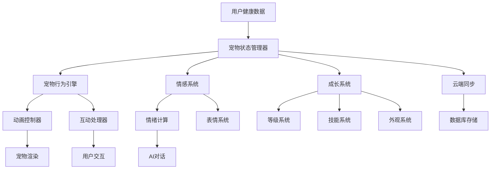

# 虚拟宠物系统实现详解

## 概述

虚拟宠物系统是健康宠物伴侣小程序的核心功能之一，通过可爱的虚拟宠物形象来激励用户保持健康的生活习惯。系统包含宠物状态管理、成长系统、互动功能、情感系统等多个模块。

## 设计理念

### 1. 核心原则
- **情感连接**：建立用户与虚拟宠物的情感纽带
- **激励机制**：通过宠物状态激励用户健康行为
- **成长体验**：提供宠物成长的满足感和成就感
- **互动乐趣**：丰富的互动方式增加使用粘性
- **个性化**：支持宠物外观和性格的个性化定制

### 2. 技术特点
- **状态驱动**：基于状态机的宠物行为管理
- **数据同步**：实时同步宠物状态和用户健康数据
- **动画系统**：流畅的宠物动画和表情系统
- **AI驱动**：智能的宠物行为和对话系统
- **云端存储**：宠物数据的云端同步和备份

## 技术架构

### 1. 系统架构图



### 2. 目录结构

```
miniprogram/
├── utils/
│   ├── petManager.js        # 宠物管理器
│   ├── petStates.js         # 宠物状态定义
│   ├── petAnimations.js     # 宠物动画系统
│   └── petAI.js            # 宠物AI系统
├── components/
│   ├── pet-avatar/         # 宠物头像组件
│   ├── pet-status/         # 宠物状态组件
│   ├── pet-interaction/    # 宠物互动组件
│   └── pet-customizer/     # 宠物定制组件
├── pages/
│   ├── home/              # 主页（宠物展示）
│   └── pet-detail/        # 宠物详情页
├── assets/
│   ├── pets/              # 宠物图片资源
│   │   ├── cat/           # 猫咪系列
│   │   ├── dog/           # 狗狗系列
│   │   └── rabbit/        # 兔子系列
│   └── animations/        # 动画资源
└── cloudfunctions/
    ├── petManager/        # 宠物管理云函数
    └── petAI/            # 宠物AI云函数
```

## 核心实现

### 1. 宠物管理器 (petManager.js)

```javascript
// utils/petManager.js
import { PetStates, PetTypes, PetMoods } from './petStates';
import PetAnimationController from './petAnimations';
import PetAI from './petAI';

class PetManager {
  constructor() {
    this.currentPet = null;
    this.petState = PetStates.IDLE;
    this.animationController = new PetAnimationController();
    this.petAI = new PetAI();
    this.observers = new Set();
    this.updateInterval = null;
    this.lastUpdateTime = Date.now();
    
    this.init();
  }
  
  /**
   * 初始化宠物管理器
   */
  async init() {
    try {
      // 加载用户宠物数据
      await this.loadUserPet();
      
      // 初始化动画控制器
      await this.animationController.init();
      
      // 初始化AI系统
      await this.petAI.init();
      
      // 开始状态更新循环
      this.startUpdateLoop();
      
      console.log('[PetManager] 初始化完成');
    } catch (error) {
      console.error('[PetManager] 初始化失败:', error);
    }
  }
  
  /**
   * 加载用户宠物数据
   */
  async loadUserPet() {
    try {
      const result = await wx.cloud.callFunction({
        name: 'petManager',
        data: {
          action: 'getUserPet'
        }
      });
      
      if (result.result.success && result.result.pet) {
        this.currentPet = result.result.pet;
      } else {
        // 创建默认宠物
        await this.createDefaultPet();
      }
      
      // 更新宠物状态
      this.updatePetState();
      
    } catch (error) {
      console.error('[PetManager] 加载宠物数据失败:', error);
      await this.createDefaultPet();
    }
  }
  
  /**
   * 创建默认宠物
   */
  async createDefaultPet() {
    const defaultPet = {
      id: this.generatePetId(),
      name: '小可爱',
      type: PetTypes.CAT,
      level: 1,
      experience: 0,
      health: 100,
      happiness: 80,
      energy: 100,
      hunger: 50,
      mood: PetMoods.HAPPY,
      appearance: {
        color: 'orange',
        pattern: 'solid',
        accessories: []
      },
      skills: [],
      achievements: [],
      stats: {
        totalDays: 0,
        totalInteractions: 0,
        totalExercise: 0,
        totalSleep: 0
      },
      createdAt: new Date(),
      lastFeedTime: null,
      lastPlayTime: null,
      lastSleepTime: null
    };
    
    this.currentPet = defaultPet;
    await this.savePetData();
  }
  
  /**
   * 更新宠物状态
   */
  updatePetState() {
    if (!this.currentPet) return;
    
    const now = Date.now();
    const timeDiff = now - this.lastUpdateTime;
    
    // 基于时间流逝更新宠物属性
    this.updatePetAttributes(timeDiff);
    
    // 根据属性计算宠物情绪
    this.calculatePetMood();
    
    // 确定宠物行为状态
    this.determinePetBehavior();
    
    // 通知观察者
    this.notifyObservers({
      type: 'pet_state_updated',
      pet: this.currentPet,
      state: this.petState
    });
    
    this.lastUpdateTime = now;
  }
  
  /**
   * 更新宠物属性
   */
  updatePetAttributes(timeDiff) {
    const hours = timeDiff / (1000 * 60 * 60);
    
    // 饥饿度随时间增加
    this.currentPet.hunger = Math.min(100, this.currentPet.hunger + hours * 2);
    
    // 能量随时间恢复（如果在睡觉）
    if (this.petState === PetStates.SLEEPING) {
      this.currentPet.energy = Math.min(100, this.currentPet.energy + hours * 10);
    } else {
      // 清醒时能量缓慢消耗
      this.currentPet.energy = Math.max(0, this.currentPet.energy - hours * 1);
    }
    
    // 健康度基于其他属性计算
    this.calculateHealth();
    
    // 快乐度基于互动和照顾计算
    this.calculateHappiness();
  }
  
  /**
   * 计算宠物健康度
   */
  calculateHealth() {
    let healthScore = 100;
    
    // 饥饿影响健康
    if (this.currentPet.hunger > 80) {
      healthScore -= (this.currentPet.hunger - 80) * 2;
    }
    
    // 能量不足影响健康
    if (this.currentPet.energy < 20) {
      healthScore -= (20 - this.currentPet.energy) * 1.5;
    }
    
    // 快乐度影响健康
    if (this.currentPet.happiness < 50) {
      healthScore -= (50 - this.currentPet.happiness) * 0.5;
    }
    
    this.currentPet.health = Math.max(0, Math.min(100, healthScore));
  }
  
  /**
   * 计算宠物快乐度
   */
  calculateHappiness() {
    const now = Date.now();
    const dayMs = 24 * 60 * 60 * 1000;
    
    let happinessDecay = 0;
    
    // 长时间没有互动会降低快乐度
    if (this.currentPet.lastPlayTime) {
      const timeSincePlay = now - new Date(this.currentPet.lastPlayTime).getTime();
      if (timeSincePlay > dayMs) {
        happinessDecay += Math.min(20, (timeSincePlay - dayMs) / dayMs * 5);
      }
    }
    
    // 长时间没有喂食会降低快乐度
    if (this.currentPet.lastFeedTime) {
      const timeSinceFeed = now - new Date(this.currentPet.lastFeedTime).getTime();
      if (timeSinceFeed > dayMs * 0.5) {
        happinessDecay += Math.min(15, (timeSinceFeed - dayMs * 0.5) / dayMs * 3);
      }
    }
    
    this.currentPet.happiness = Math.max(0, this.currentPet.happiness - happinessDecay);
  }
  
  /**
   * 计算宠物情绪
   */
  calculatePetMood() {
    const { health, happiness, energy, hunger } = this.currentPet;
    
    // 综合评分
    const overallScore = (health + happiness + energy + (100 - hunger)) / 4;
    
    if (overallScore >= 80) {
      this.currentPet.mood = PetMoods.VERY_HAPPY;
    } else if (overallScore >= 60) {
      this.currentPet.mood = PetMoods.HAPPY;
    } else if (overallScore >= 40) {
      this.currentPet.mood = PetMoods.NEUTRAL;
    } else if (overallScore >= 20) {
      this.currentPet.mood = PetMoods.SAD;
    } else {
      this.currentPet.mood = PetMoods.VERY_SAD;
    }
    
    // 特殊状态判断
    if (hunger > 90) {
      this.currentPet.mood = PetMoods.HUNGRY;
    } else if (energy < 10) {
      this.currentPet.mood = PetMoods.TIRED;
    } else if (health < 30) {
      this.currentPet.mood = PetMoods.SICK;
    }
  }
  
  /**
   * 确定宠物行为状态
   */
  determinePetBehavior() {
    const { mood, energy, hunger } = this.currentPet;
    
    // 基于情绪和属性确定行为
    if (energy < 20) {
      this.petState = PetStates.SLEEPING;
    } else if (hunger > 80) {
      this.petState = PetStates.HUNGRY;
    } else if (mood === PetMoods.VERY_HAPPY) {
      this.petState = PetStates.PLAYING;
    } else if (mood === PetMoods.SAD || mood === PetMoods.VERY_SAD) {
      this.petState = PetStates.SAD;
    } else {
      this.petState = PetStates.IDLE;
    }
    
    // 更新动画
    this.animationController.playAnimation(this.petState, this.currentPet.mood);
  }
  
  /**
   * 喂食宠物
   */
  async feedPet(foodType = 'normal') {
    if (!this.currentPet) return { success: false, message: '宠物不存在' };
    
    try {
      const feedResult = this.calculateFeedEffect(foodType);
      
      // 更新宠物属性
      this.currentPet.hunger = Math.max(0, this.currentPet.hunger - feedResult.hungerReduction);
      this.currentPet.happiness = Math.min(100, this.currentPet.happiness + feedResult.happinessBonus);
      this.currentPet.health = Math.min(100, this.currentPet.health + feedResult.healthBonus);
      this.currentPet.experience += feedResult.experienceGain;
      this.currentPet.lastFeedTime = new Date();
      
      // 检查升级
      await this.checkLevelUp();
      
      // 保存数据
      await this.savePetData();
      
      // 播放喂食动画
      await this.animationController.playFeedAnimation(foodType);
      
      // 更新状态
      this.updatePetState();
      
      return {
        success: true,
        message: '喂食成功！',
        effect: feedResult
      };
      
    } catch (error) {
      console.error('[PetManager] 喂食失败:', error);
      return { success: false, message: '喂食失败' };
    }
  }
  
  /**
   * 计算喂食效果
   */
  calculateFeedEffect(foodType) {
    const foodEffects = {
      normal: {
        hungerReduction: 30,
        happinessBonus: 10,
        healthBonus: 5,
        experienceGain: 10
      },
      premium: {
        hungerReduction: 50,
        happinessBonus: 20,
        healthBonus: 15,
        experienceGain: 20
      },
      treat: {
        hungerReduction: 10,
        happinessBonus: 30,
        healthBonus: 0,
        experienceGain: 5
      }
    };
    
    return foodEffects[foodType] || foodEffects.normal;
  }
  
  /**
   * 与宠物玩耍
   */
  async playWithPet(gameType = 'ball') {
    if (!this.currentPet) return { success: false, message: '宠物不存在' };
    
    if (this.currentPet.energy < 20) {
      return { success: false, message: '宠物太累了，需要休息' };
    }
    
    try {
      const playResult = this.calculatePlayEffect(gameType);
      
      // 更新宠物属性
      this.currentPet.energy = Math.max(0, this.currentPet.energy - playResult.energyCost);
      this.currentPet.happiness = Math.min(100, this.currentPet.happiness + playResult.happinessBonus);
      this.currentPet.experience += playResult.experienceGain;
      this.currentPet.lastPlayTime = new Date();
      
      // 更新统计
      this.currentPet.stats.totalInteractions++;
      
      // 检查升级
      await this.checkLevelUp();
      
      // 保存数据
      await this.savePetData();
      
      // 播放游戏动画
      await this.animationController.playGameAnimation(gameType);
      
      // 更新状态
      this.updatePetState();
      
      return {
        success: true,
        message: '玩耍愉快！',
        effect: playResult
      };
      
    } catch (error) {
      console.error('[PetManager] 玩耍失败:', error);
      return { success: false, message: '玩耍失败' };
    }
  }
  
  /**
   * 计算玩耍效果
   */
  calculatePlayEffect(gameType) {
    const gameEffects = {
      ball: {
        energyCost: 15,
        happinessBonus: 25,
        experienceGain: 15
      },
      frisbee: {
        energyCost: 25,
        happinessBonus: 35,
        experienceGain: 25
      },
      puzzle: {
        energyCost: 10,
        happinessBonus: 20,
        experienceGain: 30
      },
      cuddle: {
        energyCost: 5,
        happinessBonus: 15,
        experienceGain: 10
      }
    };
    
    return gameEffects[gameType] || gameEffects.ball;
  }
  
  /**
   * 检查宠物升级
   */
  async checkLevelUp() {
    const requiredExp = this.calculateRequiredExperience(this.currentPet.level);
    
    if (this.currentPet.experience >= requiredExp) {
      const oldLevel = this.currentPet.level;
      this.currentPet.level++;
      this.currentPet.experience -= requiredExp;
      
      // 升级奖励
      const levelUpRewards = this.calculateLevelUpRewards(this.currentPet.level);
      this.applyLevelUpRewards(levelUpRewards);
      
      // 通知升级
      this.notifyObservers({
        type: 'pet_level_up',
        oldLevel,
        newLevel: this.currentPet.level,
        rewards: levelUpRewards
      });
      
      // 播放升级动画
      await this.animationController.playLevelUpAnimation();
      
      return true;
    }
    
    return false;
  }
  
  /**
   * 计算升级所需经验
   */
  calculateRequiredExperience(level) {
    return Math.floor(100 * Math.pow(1.5, level - 1));
  }
  
  /**
   * 计算升级奖励
   */
  calculateLevelUpRewards(level) {
    const rewards = {
      healthBonus: 10,
      happinessBonus: 20,
      newSkills: [],
      newAccessories: []
    };
    
    // 特定等级的特殊奖励
    if (level % 5 === 0) {
      rewards.newSkills.push(this.getRandomSkill());
    }
    
    if (level % 3 === 0) {
      rewards.newAccessories.push(this.getRandomAccessory());
    }
    
    return rewards;
  }
  
  /**
   * 应用升级奖励
   */
  applyLevelUpRewards(rewards) {
    this.currentPet.health = Math.min(100, this.currentPet.health + rewards.healthBonus);
    this.currentPet.happiness = Math.min(100, this.currentPet.happiness + rewards.happinessBonus);
    
    // 添加新技能
    rewards.newSkills.forEach(skill => {
      if (!this.currentPet.skills.includes(skill)) {
        this.currentPet.skills.push(skill);
      }
    });
    
    // 添加新配饰
    rewards.newAccessories.forEach(accessory => {
      if (!this.currentPet.appearance.accessories.includes(accessory)) {
        this.currentPet.appearance.accessories.push(accessory);
      }
    });
  }
  
  /**
   * 获取随机技能
   */
  getRandomSkill() {
    const availableSkills = [
      'fetch', 'sit', 'rollover', 'dance', 'sing', 'jump', 'spin'
    ];
    
    const unlockedSkills = availableSkills.filter(
      skill => !this.currentPet.skills.includes(skill)
    );
    
    if (unlockedSkills.length === 0) return null;
    
    return unlockedSkills[Math.floor(Math.random() * unlockedSkills.length)];
  }
  
  /**
   * 获取随机配饰
   */
  getRandomAccessory() {
    const availableAccessories = [
      'hat', 'bow', 'collar', 'glasses', 'scarf', 'crown', 'flower'
    ];
    
    const unlockedAccessories = availableAccessories.filter(
      accessory => !this.currentPet.appearance.accessories.includes(accessory)
    );
    
    if (unlockedAccessories.length === 0) return null;
    
    return unlockedAccessories[Math.floor(Math.random() * unlockedAccessories.length)];
  }
  
  /**
   * 同步健康数据到宠物
   */
  async syncHealthData(healthData) {
    if (!this.currentPet) return;
    
    try {
      // 根据健康数据调整宠物属性
      const healthEffect = this.calculateHealthEffect(healthData);
      
      this.currentPet.health = Math.min(100, this.currentPet.health + healthEffect.healthBonus);
      this.currentPet.happiness = Math.min(100, this.currentPet.happiness + healthEffect.happinessBonus);
      this.currentPet.experience += healthEffect.experienceGain;
      
      // 更新统计
      this.currentPet.stats.totalExercise += healthData.exercise || 0;
      this.currentPet.stats.totalSleep += healthData.sleep || 0;
      
      // 检查升级
      await this.checkLevelUp();
      
      // 保存数据
      await this.savePetData();
      
      // 更新状态
      this.updatePetState();
      
      console.log('[PetManager] 健康数据同步完成');
      
    } catch (error) {
      console.error('[PetManager] 健康数据同步失败:', error);
    }
  }
  
  /**
   * 计算健康数据对宠物的影响
   */
  calculateHealthEffect(healthData) {
    let healthBonus = 0;
    let happinessBonus = 0;
    let experienceGain = 0;
    
    // 步数影响
    if (healthData.steps) {
      const stepGoal = 10000;
      const stepRatio = Math.min(1, healthData.steps / stepGoal);
      healthBonus += stepRatio * 10;
      happinessBonus += stepRatio * 15;
      experienceGain += stepRatio * 20;
    }
    
    // 睡眠影响
    if (healthData.sleep) {
      const sleepGoal = 8; // 8小时
      const sleepRatio = Math.min(1, healthData.sleep / sleepGoal);
      healthBonus += sleepRatio * 15;
      happinessBonus += sleepRatio * 10;
      experienceGain += sleepRatio * 15;
    }
    
    // 运动影响
    if (healthData.exercise) {
      const exerciseGoal = 60; // 60分钟
      const exerciseRatio = Math.min(1, healthData.exercise / exerciseGoal);
      healthBonus += exerciseRatio * 20;
      happinessBonus += exerciseRatio * 25;
      experienceGain += exerciseRatio * 30;
    }
    
    // 饮水影响
    if (healthData.water) {
      const waterGoal = 2000; // 2000ml
      const waterRatio = Math.min(1, healthData.water / waterGoal);
      healthBonus += waterRatio * 5;
      experienceGain += waterRatio * 10;
    }
    
    return {
      healthBonus: Math.floor(healthBonus),
      happinessBonus: Math.floor(happinessBonus),
      experienceGain: Math.floor(experienceGain)
    };
  }
  
  /**
   * 保存宠物数据
   */
  async savePetData() {
    try {
      await wx.cloud.callFunction({
        name: 'petManager',
        data: {
          action: 'savePet',
          pet: this.currentPet
        }
      });
    } catch (error) {
      console.error('[PetManager] 保存宠物数据失败:', error);
    }
  }
  
  /**
   * 开始更新循环
   */
  startUpdateLoop() {
    if (this.updateInterval) {
      clearInterval(this.updateInterval);
    }
    
    this.updateInterval = setInterval(() => {
      this.updatePetState();
    }, 60000); // 每分钟更新一次
  }
  
  /**
   * 停止更新循环
   */
  stopUpdateLoop() {
    if (this.updateInterval) {
      clearInterval(this.updateInterval);
      this.updateInterval = null;
    }
  }
  
  /**
   * 添加观察者
   */
  addObserver(observer) {
    this.observers.add(observer);
  }
  
  /**
   * 移除观察者
   */
  removeObserver(observer) {
    this.observers.delete(observer);
  }
  
  /**
   * 通知观察者
   */
  notifyObservers(event) {
    this.observers.forEach(observer => {
      try {
        observer(event);
      } catch (error) {
        console.error('[PetManager] 通知观察者失败:', error);
      }
    });
  }
  
  /**
   * 生成宠物ID
   */
  generatePetId() {
    return 'pet_' + Date.now() + '_' + Math.random().toString(36).substr(2, 9);
  }
  
  /**
   * 获取当前宠物
   */
  getCurrentPet() {
    return this.currentPet;
  }
  
  /**
   * 获取宠物状态
   */
  getPetState() {
    return this.petState;
  }
  
  /**
   * 销毁管理器
   */
  destroy() {
    this.stopUpdateLoop();
    this.observers.clear();
    this.animationController.destroy();
    this.petAI.destroy();
  }
}

// 创建全局宠物管理器实例
const petManager = new PetManager();

export default petManager;
```

### 2. 宠物状态定义 (petStates.js)

```javascript
// utils/petStates.js

// 宠物类型
export const PetTypes = {
  CAT: 'cat',
  DOG: 'dog',
  RABBIT: 'rabbit',
  HAMSTER: 'hamster',
  BIRD: 'bird'
};

// 宠物状态
export const PetStates = {
  IDLE: 'idle',           // 闲置
  PLAYING: 'playing',     // 玩耍
  EATING: 'eating',       // 进食
  SLEEPING: 'sleeping',   // 睡觉
  HUNGRY: 'hungry',       // 饥饿
  SAD: 'sad',            // 伤心
  EXCITED: 'excited',     // 兴奋
  SICK: 'sick'           // 生病
};

// 宠物情绪
export const PetMoods = {
  VERY_HAPPY: 'very_happy',
  HAPPY: 'happy',
  NEUTRAL: 'neutral',
  SAD: 'sad',
  VERY_SAD: 'very_sad',
  HUNGRY: 'hungry',
  TIRED: 'tired',
  SICK: 'sick',
  EXCITED: 'excited',
  ANGRY: 'angry'
};

// 宠物技能
export const PetSkills = {
  FETCH: 'fetch',         // 捡球
  SIT: 'sit',            // 坐下
  ROLLOVER: 'rollover',   // 翻滚
  DANCE: 'dance',         // 跳舞
  SING: 'sing',          // 唱歌
  JUMP: 'jump',          // 跳跃
  SPIN: 'spin',          // 转圈
  SHAKE: 'shake',        // 握手
  PLAY_DEAD: 'play_dead', // 装死
  SPEAK: 'speak'         // 说话
};

// 宠物配饰
export const PetAccessories = {
  HAT: 'hat',            // 帽子
  BOW: 'bow',            // 蝴蝶结
  COLLAR: 'collar',       // 项圈
  GLASSES: 'glasses',     // 眼镜
  SCARF: 'scarf',        // 围巾
  CROWN: 'crown',        // 皇冠
  FLOWER: 'flower',      // 花朵
  BANDANA: 'bandana',    // 头巾
  NECKLACE: 'necklace',  // 项链
  EARRINGS: 'earrings'   // 耳环
};

// 宠物颜色
export const PetColors = {
  WHITE: 'white',
  BLACK: 'black',
  BROWN: 'brown',
  ORANGE: 'orange',
  GRAY: 'gray',
  GOLDEN: 'golden',
  SILVER: 'silver',
  CREAM: 'cream',
  SPOTTED: 'spotted',
  STRIPED: 'striped'
};

// 宠物图案
export const PetPatterns = {
  SOLID: 'solid',        // 纯色
  SPOTTED: 'spotted',    // 斑点
  STRIPED: 'striped',    // 条纹
  MIXED: 'mixed',        // 混合
  GRADIENT: 'gradient'   // 渐变
};

// 宠物成就
export const PetAchievements = {
  FIRST_FEED: 'first_feed',           // 第一次喂食
  FIRST_PLAY: 'first_play',           // 第一次玩耍
  LEVEL_5: 'level_5',                 // 达到5级
  LEVEL_10: 'level_10',               // 达到10级
  LEVEL_20: 'level_20',               // 达到20级
  HAPPY_WEEK: 'happy_week',           // 连续一周快乐
  HEALTHY_MONTH: 'healthy_month',     // 连续一月健康
  MASTER_TRAINER: 'master_trainer',   // 掌握所有技能
  FASHIONISTA: 'fashionista',         // 收集所有配饰
  LOYAL_FRIEND: 'loyal_friend',       // 陪伴100天
  EXERCISE_BUDDY: 'exercise_buddy',   // 运动伙伴
  SLEEP_CHAMPION: 'sleep_champion'    // 睡眠冠军
};

// 状态转换规则
export const StateTransitions = {
  [PetStates.IDLE]: {
    canTransitionTo: [
      PetStates.PLAYING,
      PetStates.EATING,
      PetStates.SLEEPING,
      PetStates.HUNGRY,
      PetStates.SAD
    ],
    conditions: {
      [PetStates.HUNGRY]: (pet) => pet.hunger > 70,
      [PetStates.SLEEPING]: (pet) => pet.energy < 30,
      [PetStates.SAD]: (pet) => pet.happiness < 30,
      [PetStates.PLAYING]: (pet) => pet.happiness > 70 && pet.energy > 50
    }
  },
  
  [PetStates.PLAYING]: {
    canTransitionTo: [
      PetStates.IDLE,
      PetStates.SLEEPING,
      PetStates.HUNGRY
    ],
    conditions: {
      [PetStates.SLEEPING]: (pet) => pet.energy < 20,
      [PetStates.HUNGRY]: (pet) => pet.hunger > 80,
      [PetStates.IDLE]: (pet) => pet.energy < 50
    }
  },
  
  [PetStates.EATING]: {
    canTransitionTo: [
      PetStates.IDLE,
      PetStates.PLAYING,
      PetStates.SLEEPING
    ],
    duration: 5000, // 5秒后自动转换
    defaultNext: PetStates.IDLE
  },
  
  [PetStates.SLEEPING]: {
    canTransitionTo: [
      PetStates.IDLE,
      PetStates.HUNGRY
    ],
    conditions: {
      [PetStates.IDLE]: (pet) => pet.energy > 80,
      [PetStates.HUNGRY]: (pet) => pet.hunger > 90
    }
  }
};

// 情绪表情映射
export const MoodExpressions = {
  [PetMoods.VERY_HAPPY]: {
    eyes: 'sparkle',
    mouth: 'big_smile',
    animation: 'bounce'
  },
  [PetMoods.HAPPY]: {
    eyes: 'bright',
    mouth: 'smile',
    animation: 'wag'
  },
  [PetMoods.NEUTRAL]: {
    eyes: 'normal',
    mouth: 'neutral',
    animation: 'idle'
  },
  [PetMoods.SAD]: {
    eyes: 'droopy',
    mouth: 'frown',
    animation: 'droop'
  },
  [PetMoods.VERY_SAD]: {
    eyes: 'tears',
    mouth: 'cry',
    animation: 'sob'
  },
  [PetMoods.HUNGRY]: {
    eyes: 'pleading',
    mouth: 'open',
    animation: 'beg'
  },
  [PetMoods.TIRED]: {
    eyes: 'sleepy',
    mouth: 'yawn',
    animation: 'drowsy'
  },
  [PetMoods.SICK]: {
    eyes: 'dizzy',
    mouth: 'sick',
    animation: 'weak'
  }
};
```

### 3. 宠物动画系统 (petAnimations.js)

```javascript
// utils/petAnimations.js
import { PetStates, PetMoods, MoodExpressions } from './petStates';

class PetAnimationController {
  constructor() {
    this.currentAnimation = null;
    this.animationQueue = [];
    this.isPlaying = false;
    this.animationElement = null;
    this.frameRate = 60;
    this.animationCache = new Map();
  }
  
  /**
   * 初始化动画控制器
   */
  async init() {
    try {
      // 预加载基础动画
      await this.preloadAnimations();
      
      console.log('[PetAnimationController] 初始化完成');
    } catch (error) {
      console.error('[PetAnimationController] 初始化失败:', error);
    }
  }
  
  /**
   * 预加载动画资源
   */
  async preloadAnimations() {
    const basicAnimations = [
      'idle', 'happy', 'sad', 'eating', 'sleeping', 'playing'
    ];
    
    for (const animation of basicAnimations) {
      try {
        await this.loadAnimation(animation);
      } catch (error) {
        console.warn(`[PetAnimationController] 加载动画 ${animation} 失败:`, error);
      }
    }
  }
  
  /**
   * 加载动画资源
   */
  async loadAnimation(animationName) {
    if (this.animationCache.has(animationName)) {
      return this.animationCache.get(animationName);
    }
    
    try {
      // 这里可以加载实际的动画文件
      const animationData = await this.fetchAnimationData(animationName);
      this.animationCache.set(animationName, animationData);
      return animationData;
    } catch (error) {
      console.error(`[PetAnimationController] 加载动画 ${animationName} 失败:`, error);
      return null;
    }
  }
  
  /**
   * 获取动画数据（模拟）
   */
  async fetchAnimationData(animationName) {
    // 模拟动画数据结构
    const animationConfigs = {
      idle: {
        frames: [
          { transform: 'translateY(0px)', duration: 1000 },
          { transform: 'translateY(-2px)', duration: 500 },
          { transform: 'translateY(0px)', duration: 500 }
        ],
        loop: true,
        easing: 'ease-in-out'
      },
      
      happy: {
        frames: [
          { transform: 'scale(1) rotate(0deg)', duration: 200 },
          { transform: 'scale(1.1) rotate(5deg)', duration: 200 },
          { transform: 'scale(1) rotate(-5deg)', duration: 200 },
          { transform: 'scale(1) rotate(0deg)', duration: 200 }
        ],
        loop: false,
        easing: 'ease-out'
      },
      
      sad: {
        frames: [
          { transform: 'translateY(0px) scale(1)', duration: 1000 },
          { transform: 'translateY(5px) scale(0.95)', duration: 1000 }
        ],
        loop: true,
        easing: 'ease-in-out'
      },
      
      eating: {
        frames: [
          { transform: 'scale(1)', duration: 300 },
          { transform: 'scale(1.05)', duration: 200 },
          { transform: 'scale(1)', duration: 300 },
          { transform: 'scale(1.05)', duration: 200 },
          { transform: 'scale(1)', duration: 300 }
        ],
        loop: false,
        easing: 'ease-in-out'
      },
      
      sleeping: {
        frames: [
          { transform: 'translateY(0px)', opacity: 1, duration: 2000 },
          { transform: 'translateY(2px)', opacity: 0.8, duration: 2000 }
        ],
        loop: true,
        easing: 'ease-in-out'
      },
      
      playing: {
        frames: [
          { transform: 'translateX(0px) rotate(0deg)', duration: 300 },
          { transform: 'translateX(-10px) rotate(-10deg)', duration: 300 },
          { transform: 'translateX(10px) rotate(10deg)', duration: 300 },
          { transform: 'translateX(0px) rotate(0deg)', duration: 300 }
        ],
        loop: true,
        easing: 'ease-in-out'
      }
    };
    
    return animationConfigs[animationName] || animationConfigs.idle;
  }
  
  /**
   * 播放动画
   */
  async playAnimation(state, mood, options = {}) {
    try {
      const animationName = this.getAnimationName(state, mood);
      const animationData = await this.loadAnimation(animationName);
      
      if (!animationData) {
        console.warn(`[PetAnimationController] 动画 ${animationName} 不存在`);
        return;
      }
      
      const { priority = 0, interrupt = false } = options;
      
      // 检查是否需要中断当前动画
      if (this.isPlaying && !interrupt && this.currentAnimation?.priority >= priority) {
        this.animationQueue.push({ animationName, animationData, options });
        return;
      }
      
      // 停止当前动画
      if (this.isPlaying) {
        this.stopCurrentAnimation();
      }
      
      // 播放新动画
      await this.executeAnimation(animationName, animationData, options);
      
    } catch (error) {
      console.error('[PetAnimationController] 播放动画失败:', error);
    }
  }
  
  /**
   * 根据状态和情绪获取动画名称
   */
  getAnimationName(state, mood) {
    // 优先使用状态动画
    if (state && state !== PetStates.IDLE) {
      return state;
    }
    
    // 根据情绪选择动画
    const moodAnimations = {
      [PetMoods.VERY_HAPPY]: 'happy',
      [PetMoods.HAPPY]: 'happy',
      [PetMoods.NEUTRAL]: 'idle',
      [PetMoods.SAD]: 'sad',
      [PetMoods.VERY_SAD]: 'sad',
      [PetMoods.HUNGRY]: 'hungry',
      [PetMoods.TIRED]: 'sleeping',
      [PetMoods.SICK]: 'sick'
    };
    
    return moodAnimations[mood] || 'idle';
  }
  
  /**
   * 执行动画
   */
  async executeAnimation(animationName, animationData, options = {}) {
    return new Promise((resolve) => {
      this.isPlaying = true;
      this.currentAnimation = {
        name: animationName,
        data: animationData,
        priority: options.priority || 0
      };
      
      const element = this.getAnimationElement();
      if (!element) {
        console.warn('[PetAnimationController] 动画元素不存在');
        this.isPlaying = false;
        resolve();
        return;
      }
      
      // 创建动画序列
      const keyframes = this.createKeyframes(animationData.frames);
      const animationOptions = {
        duration: this.calculateTotalDuration(animationData.frames),
        easing: animationData.easing || 'ease',
        iterations: animationData.loop ? Infinity : 1,
        fill: 'forwards'
      };
      
      // 播放动画
      const animation = element.animate(keyframes, animationOptions);
      
      animation.onfinish = () => {
        this.isPlaying = false;
        this.currentAnimation = null;
        
        // 播放队列中的下一个动画
        this.playNextAnimation();
        
        resolve();
      };
      
      animation.onerror = (error) => {
        console.error('[PetAnimationController] 动画播放错误:', error);
        this.isPlaying = false;
        this.currentAnimation = null;
        resolve();
      };
    });
  }
  
  /**
   * 创建关键帧
   */
  createKeyframes(frames) {
    return frames.map(frame => ({
      transform: frame.transform || 'none',
      opacity: frame.opacity !== undefined ? frame.opacity : 1,
      offset: frame.offset
    }));
  }
  
  /**
   * 计算总动画时长
   */
  calculateTotalDuration(frames) {
    return frames.reduce((total, frame) => total + (frame.duration || 0), 0);
  }
  
  /**
   * 获取动画元素
   */
  getAnimationElement() {
    if (!this.animationElement) {
      // 在实际应用中，这里应该获取宠物的DOM元素
      this.animationElement = document.querySelector('.pet-avatar');
    }
    return this.animationElement;
  }
  
  /**
   * 停止当前动画
   */
  stopCurrentAnimation() {
    const element = this.getAnimationElement();
    if (element && element.getAnimations) {
      element.getAnimations().forEach(animation => {
        animation.cancel();
      });
    }
    
    this.isPlaying = false;
    this.currentAnimation = null;
  }
  
  /**
   * 播放下一个动画
   */
  async playNextAnimation() {
    if (this.animationQueue.length > 0) {
      const next = this.animationQueue.shift();
      await this.executeAnimation(next.animationName, next.animationData, next.options);
    }
  }
  
  /**
   * 播放喂食动画
   */
  async playFeedAnimation(foodType) {
    const feedAnimations = {
      normal: 'eating',
      premium: 'eating_happy',
      treat: 'eating_excited'
    };
    
    const animationName = feedAnimations[foodType] || 'eating';
    await this.playAnimation(PetStates.EATING, null, {
      priority: 10,
      interrupt: true
    });
    
    // 播放满足表情
    setTimeout(() => {
      this.playAnimation(PetStates.IDLE, PetMoods.HAPPY);
    }, 2000);
  }
  
  /**
   * 播放游戏动画
   */
  async playGameAnimation(gameType) {
    const gameAnimations = {
      ball: 'playing_ball',
      frisbee: 'playing_frisbee',
      puzzle: 'thinking',
      cuddle: 'cuddling'
    };
    
    const animationName = gameAnimations[gameType] || 'playing';
    await this.playAnimation(PetStates.PLAYING, null, {
      priority: 10,
      interrupt: true
    });
    
    // 播放开心表情
    setTimeout(() => {
      this.playAnimation(PetStates.IDLE, PetMoods.VERY_HAPPY);
    }, 3000);
  }
  
  /**
   * 播放升级动画
   */
  async playLevelUpAnimation() {
    // 播放特殊的升级动画
    const levelUpAnimation = {
      frames: [
        { transform: 'scale(1)', filter: 'brightness(1)', duration: 200 },
        { transform: 'scale(1.2)', filter: 'brightness(1.5)', duration: 300 },
        { transform: 'scale(1.1)', filter: 'brightness(1.3)', duration: 200 },
        { transform: 'scale(1)', filter: 'brightness(1)', duration: 300 }
      ],
      loop: false,
      easing: 'ease-out'
    };
    
    await this.executeAnimation('level_up', levelUpAnimation, {
      priority: 20,
      interrupt: true
    });
  }
  
  /**
   * 设置动画元素
   */
  setAnimationElement(element) {
    this.animationElement = element;
  }
  
  /**
   * 清空动画队列
   */
  clearQueue() {
    this.animationQueue = [];
  }
  
  /**
   * 销毁动画控制器
   */
  destroy() {
    this.stopCurrentAnimation();
    this.clearQueue();
    this.animationCache.clear();
    this.animationElement = null;
  }
}

export default PetAnimationController;
```

## 宠物头像组件

### 1. 组件实现 (pet-avatar/index.js)

```javascript
// components/pet-avatar/index.js
import petManager from '../../utils/petManager';

Component({
  properties: {
    // 头像大小
    size: {
      type: String,
      value: 'medium' // small, medium, large
    },
    // 是否显示状态指示器
    showStatus: {
      type: Boolean,
      value: true
    },
    // 是否可交互
    interactive: {
      type: Boolean,
      value: true
    },
    // 自定义样式
    customStyle: {
      type: String,
      value: ''
    }
  },
  
  data: {
    pet: null,
    petState: 'idle',
    isAnimating: false,
    statusText: ''
  },
  
  lifetimes: {
    attached() {
      this.initPetAvatar();
    },
    
    detached() {
      // 移除宠物状态监听
      petManager.removeObserver(this.petStateHandler);
    }
  },
  
  methods: {
    /**
     * 初始化宠物头像
     */
    initPetAvatar() {
      // 获取当前宠物
      const pet = petManager.getCurrentPet();
      const petState = petManager.getPetState();
      
      this.setData({
        pet,
        petState,
        statusText: this.getStatusText(pet, petState)
      });
      
      // 监听宠物状态变化
      this.petStateHandler = (event) => {
        this.handlePetStateChange(event);
      };
      
      petManager.addObserver(this.petStateHandler);
      
      // 设置动画元素
      this.setAnimationElement();
    },
    
    /**
     * 处理宠物状态变化
     */
    handlePetStateChange(event) {
      if (event.type === 'pet_state_updated') {
        this.setData({
          pet: event.pet,
          petState: event.state,
          statusText: this.getStatusText(event.pet, event.state)
        });
      } else if (event.type === 'pet_level_up') {
        this.showLevelUpEffect();
      }
    },
    
    /**
     * 获取状态文本
     */
    getStatusText(pet, state) {
      if (!pet) return '';
      
      const statusTexts = {
        idle: `${pet.name} 正在休息`,
        playing: `${pet.name} 正在玩耍`,
        eating: `${pet.name} 正在进食`,
        sleeping: `${pet.name} 正在睡觉`,
        hungry: `${pet.name} 饿了`,
        sad: `${pet.name} 有点伤心`,
        excited: `${pet.name} 很兴奋`,
        sick: `${pet.name} 不舒服`
      };
      
      return statusTexts[state] || `${pet.name} Lv.${pet.level}`;
    },
    
    /**
     * 宠物点击事件
     */
    onPetTap() {
      if (!this.data.interactive || this.data.isAnimating) {
        return;
      }
      
      // 触发宠物交互
      this.triggerPetInteraction();
      
      // 触发组件事件
      this.triggerEvent('pettap', {
        pet: this.data.pet,
        state: this.data.petState
      });
    },
    
    /**
     * 触发宠物交互
     */
    async triggerPetInteraction() {
      try {
        this.setData({ isAnimating: true });
        
        // 根据当前状态执行不同的交互
        const { pet, petState } = this.data;
        
        if (petState === 'hungry') {
          // 显示喂食提示
          this.showFeedingPrompt();
        } else if (petState === 'sad') {
          // 安慰宠物
          await this.comfortPet();
        } else if (petState === 'sleeping') {
          // 轻抚宠物
          await this.petGently();
        } else {
          // 普通互动
          await this.playWithPet();
        }
        
      } catch (error) {
        console.error('[PetAvatar] 宠物交互失败:', error);
      } finally {
        this.setData({ isAnimating: false });
      }
    },
    
    /**
     * 显示喂食提示
     */
    showFeedingPrompt() {
      wx.showModal({
        title: '宠物饿了',
        content: `${this.data.pet.name} 饿了，要不要喂点东西？`,
        confirmText: '喂食',
        cancelText: '稍后',
        success: (res) => {
          if (res.confirm) {
            this.feedPet();
          }
        }
      });
    },
    
    /**
     * 喂食宠物
     */
    async feedPet() {
      try {
        const result = await petManager.feedPet('normal');
        
        if (result.success) {
          wx.showToast({
            title: result.message,
            icon: 'success'
          });
        } else {
          wx.showToast({
            title: result.message,
            icon: 'error'
          });
        }
      } catch (error) {
        console.error('[PetAvatar] 喂食失败:', error);
      }
    },
    
    /**
     * 安慰宠物
     */
    async comfortPet() {
      // 播放安慰动画
      await petManager.animationController.playAnimation('comfort', null, {
        priority: 5,
        interrupt: true
      });
      
      // 增加一点快乐度
      if (this.data.pet) {
        this.data.pet.happiness = Math.min(100, this.data.pet.happiness + 5);
      }
    },
    
    /**
     * 轻抚宠物
     */
    async petGently() {
      // 播放轻抚动画
      await petManager.animationController.playAnimation('pet', null, {
        priority: 3,
        interrupt: false
      });
    },
    
    /**
     * 与宠物玩耍
     */
    async playWithPet() {
      try {
        const result = await petManager.playWithPet('cuddle');
        
        if (result.success) {
          wx.showToast({
            title: result.message,
            icon: 'success',
            duration: 1500
          });
        }
      } catch (error) {
        console.error('[PetAvatar] 玩耍失败:', error);
      }
    },
    
    /**
     * 显示升级效果
     */
    showLevelUpEffect() {
      this.setData({ isAnimating: true });
      
      // 显示升级提示
      wx.showToast({
        title: `${this.data.pet.name} 升级了！`,
        icon: 'success',
        duration: 2000
      });
      
      setTimeout(() => {
        this.setData({ isAnimating: false });
      }, 2000);
    },
    
    /**
     * 设置动画元素
     */
    setAnimationElement() {
      // 在下一个事件循环中设置，确保DOM已渲染
      setTimeout(() => {
        const query = this.createSelectorQuery();
        query.select('.pet-avatar-image').boundingClientRect();
        query.exec((res) => {
          if (res[0] && petManager.animationController) {
            // 这里可以设置动画元素引用
            console.log('[PetAvatar] 动画元素已设置');
          }
        });
      }, 100);
    },
    
    /**
     * 获取宠物图片路径
     */
    getPetImagePath() {
      const { pet } = this.data;
      if (!pet) return '/assets/pets/default.png';
      
      const { type, appearance } = pet;
      const { color, pattern } = appearance;
      
      return `/assets/pets/${type}/${color}_${pattern}.png`;
    },
    
    /**
     * 获取状态图标
     */
    getStatusIcon() {
      const { petState } = this.data;
      
      const statusIcons = {
        idle: 'icon-heart',
        playing: 'icon-play',
        eating: 'icon-food',
        sleeping: 'icon-sleep',
        hungry: 'icon-hungry',
        sad: 'icon-sad',
        excited: 'icon-star',
        sick: 'icon-sick'
      };
      
      return statusIcons[petState] || 'icon-heart';
    }
  }
});
```

### 2. 组件模板 (pet-avatar/index.wxml)

```xml
<!-- components/pet-avatar/index.wxml -->
<view class="pet-avatar {{size}} {{isAnimating ? 'animating' : ''}}" style="{{customStyle}}">
  <!-- 宠物图片 -->
  <view class="pet-image-container" bindtap="onPetTap">
    <image 
      class="pet-avatar-image"
      src="{{getPetImagePath()}}"
      mode="aspectFit"
    />
    
    <!-- 宠物配饰 -->
    <view wx:if="{{pet && pet.appearance.accessories.length > 0}}" class="pet-accessories">
      <image 
        wx:for="{{pet.appearance.accessories}}" 
        wx:key="*this"
        class="accessory accessory-{{item}}"
        src="/assets/accessories/{{item}}.png"
        mode="aspectFit"
      />
    </view>
    
    <!-- 状态指示器 -->
    <view wx:if="{{showStatus}}" class="status-indicator">
      <text class="iconfont {{getStatusIcon()}}"></text>
    </view>
    
    <!-- 等级标识 -->
    <view wx:if="{{pet}}" class="level-badge">
      <text>Lv.{{pet.level}}</text>
    </view>
  </view>
  
  <!-- 状态文本 -->
  <view wx:if="{{showStatus && statusText}}" class="status-text">
    <text>{{statusText}}</text>
  </view>
  
  <!-- 属性条 -->
  <view wx:if="{{pet && size === 'large'}}" class="pet-stats">
    <view class="stat-bar">
      <text class="stat-label">健康</text>
      <view class="stat-progress">
        <view class="stat-fill health" style="width: {{pet.health}}%"></view>
      </view>
      <text class="stat-value">{{pet.health}}</text>
    </view>
    
    <view class="stat-bar">
      <text class="stat-label">快乐</text>
      <view class="stat-progress">
        <view class="stat-fill happiness" style="width: {{pet.happiness}}%"></view>
      </view>
      <text class="stat-value">{{pet.happiness}}</text>
    </view>
    
    <view class="stat-bar">
      <text class="stat-label">能量</text>
      <view class="stat-progress">
        <view class="stat-fill energy" style="width: {{pet.energy}}%"></view>
      </view>
      <text class="stat-value">{{pet.energy}}</text>
    </view>
  </view>
</view>
```

### 3. 组件样式 (pet-avatar/index.wxss)

```css
/* components/pet-avatar/index.wxss */

.pet-avatar {
  display: flex;
  flex-direction: column;
  align-items: center;
  position: relative;
}

/* 尺寸变体 */
.pet-avatar.small {
  width: 60px;
}

.pet-avatar.medium {
  width: 100px;
}

.pet-avatar.large {
  width: 150px;
}

.pet-image-container {
  position: relative;
  width: 100%;
  aspect-ratio: 1;
  border-radius: 50%;
  overflow: hidden;
  background: linear-gradient(135deg, var(--color-primary), var(--color-secondary));
  padding: 4px;
  transition: all 0.3s ease;
}

.pet-image-container:active {
  transform: scale(0.95);
}

.pet-avatar-image {
  width: 100%;
  height: 100%;
  border-radius: 50%;
  background: var(--color-surface);
}

/* 动画状态 */
.pet-avatar.animating .pet-image-container {
  animation: petPulse 1s ease-in-out infinite;
}

@keyframes petPulse {
  0%, 100% {
    transform: scale(1);
  }
  50% {
    transform: scale(1.05);
  }
}

/* 配饰 */
.pet-accessories {
  position: absolute;
  top: 0;
  left: 0;
  width: 100%;
  height: 100%;
  pointer-events: none;
}

.accessory {
  position: absolute;
  width: 30%;
  height: 30%;
}

.accessory-hat {
  top: -10%;
  left: 35%;
}

.accessory-bow {
  top: 20%;
  right: -5%;
}

.accessory-collar {
  bottom: 30%;
  left: 50%;
  transform: translateX(-50%);
  width: 80%;
  height: 20%;
}

.accessory-glasses {
  top: 35%;
  left: 50%;
  transform: translateX(-50%);
  width: 60%;
  height: 25%;
}

/* 状态指示器 */
.status-indicator {
  position: absolute;
  top: -5px;
  right: -5px;
  width: 24px;
  height: 24px;
  background: var(--color-primary);
  border-radius: 50%;
  display: flex;
  align-items: center;
  justify-content: center;
  color: white;
  font-size: 12px;
  border: 2px solid var(--color-background);
  animation: statusPulse 2s ease-in-out infinite;
}

@keyframes statusPulse {
  0%, 100% {
    opacity: 1;
  }
  50% {
    opacity: 0.7;
  }
}

/* 等级标识 */
.level-badge {
  position: absolute;
  bottom: -5px;
  left: 50%;
  transform: translateX(-50%);
  background: var(--color-warning);
  color: white;
  padding: 2px 8px;
  border-radius: 12px;
  font-size: 10px;
  font-weight: bold;
  border: 2px solid var(--color-background);
}

/* 状态文本 */
.status-text {
  margin-top: var(--spacing-sm);
  text-align: center;
}

.status-text text {
  font-size: var(--font-size-sm);
  color: var(--color-text-secondary);
}

/* 属性条 */
.pet-stats {
  width: 100%;
  margin-top: var(--spacing-md);
  padding: var(--spacing-sm);
  background: var(--color-surface);
  border-radius: var(--border-radius-md);
}

.stat-bar {
  display: flex;
  align-items: center;
  margin-bottom: var(--spacing-xs);
}

.stat-bar:last-child {
  margin-bottom: 0;
}

.stat-label {
  width: 40px;
  font-size: var(--font-size-xs);
  color: var(--color-text-secondary);
}

.stat-progress {
  flex: 1;
  height: 8px;
  background: var(--color-border);
  border-radius: 4px;
  margin: 0 var(--spacing-xs);
  overflow: hidden;
}

.stat-fill {
  height: 100%;
  border-radius: 4px;
  transition: width 0.3s ease;
}

.stat-fill.health {
  background: linear-gradient(90deg, #ff6b6b, #ee5a52);
}

.stat-fill.happiness {
  background: linear-gradient(90deg, #feca57, #ff9ff3);
}

.stat-fill.energy {
  background: linear-gradient(90deg, #48dbfb, #0abde3);
}

.stat-value {
  width: 30px;
  text-align: right;
  font-size: var(--font-size-xs);
  color: var(--color-text);
  font-weight: bold;
}

/* 小尺寸适配 */
.pet-avatar.small .status-indicator {
  width: 18px;
  height: 18px;
  font-size: 10px;
}

.pet-avatar.small .level-badge {
  padding: 1px 6px;
  font-size: 8px;
}

/* 大尺寸适配 */
.pet-avatar.large .status-indicator {
  width: 30px;
  height: 30px;
  font-size: 14px;
}

.pet-avatar.large .level-badge {
  padding: 4px 12px;
  font-size: 12px;
}
```

## 云函数实现

### 1. 宠物管理云函数 (petManager/index.js)

```javascript
// cloudfunctions/petManager/index.js
const cloud = require('wx-server-sdk');

cloud.init({
  env: cloud.DYNAMIC_CURRENT_ENV
});

const db = cloud.database();
const _ = db.command;

exports.main = async (event, context) => {
  const { action, pet, userId } = event;
  const { OPENID } = cloud.getWXContext();
  const userOpenId = userId || OPENID;
  
  try {
    switch (action) {
      case 'getUserPet':
        return await getUserPet(userOpenId);
      case 'savePet':
        return await savePet(userOpenId, pet);
      case 'createPet':
        return await createPet(userOpenId, pet);
      case 'updatePetStats':
        return await updatePetStats(userOpenId, event.stats);
      case 'getPetHistory':
        return await getPetHistory(userOpenId);
      default:
        return { success: false, message: '未知操作' };
    }
  } catch (error) {
    console.error('[petManager] 操作失败:', error);
    return { success: false, message: '操作失败', error: error.message };
  }
};

/**
 * 获取用户宠物
 */
async function getUserPet(userOpenId) {
  try {
    const result = await db.collection('pets')
      .where({ userId: userOpenId })
      .orderBy('createdAt', 'desc')
      .limit(1)
      .get();
    
    if (result.data.length > 0) {
      return {
        success: true,
        pet: result.data[0]
      };
    } else {
      return {
        success: true,
        pet: null
      };
    }
  } catch (error) {
    console.error('[getUserPet] 获取宠物失败:', error);
    throw error;
  }
}

/**
 * 保存宠物数据
 */
async function savePet(userOpenId, pet) {
  try {
    const updateData = {
      ...pet,
      userId: userOpenId,
      updatedAt: new Date()
    };
    
    if (pet._id) {
      // 更新现有宠物
      const { _id, ...petData } = updateData;
      await db.collection('pets')
        .doc(_id)
        .update({
          data: petData
        });
    } else {
      // 创建新宠物
      updateData.createdAt = new Date();
      await db.collection('pets').add({
        data: updateData
      });
    }
    
    return { success: true, message: '宠物数据保存成功' };
  } catch (error) {
    console.error('[savePet] 保存宠物失败:', error);
    throw error;
  }
}

/**
 * 创建新宠物
 */
async function createPet(userOpenId, petConfig) {
  try {
    const newPet = {
      userId: userOpenId,
      id: generatePetId(),
      name: petConfig.name || '小可爱',
      type: petConfig.type || 'cat',
      level: 1,
      experience: 0,
      health: 100,
      happiness: 80,
      energy: 100,
      hunger: 50,
      mood: 'happy',
      appearance: {
        color: petConfig.appearance?.color || 'orange',
        pattern: petConfig.appearance?.pattern || 'solid',
        accessories: []
      },
      skills: [],
      achievements: [],
      stats: {
        totalDays: 0,
        totalInteractions: 0,
        totalExercise: 0,
        totalSleep: 0
      },
      createdAt: new Date(),
      updatedAt: new Date(),
      lastFeedTime: null,
      lastPlayTime: null,
      lastSleepTime: null
    };
    
    const result = await db.collection('pets').add({
      data: newPet
    });
    
    return {
      success: true,
      message: '宠物创建成功',
      pet: { ...newPet, _id: result._id }
    };
  } catch (error) {
    console.error('[createPet] 创建宠物失败:', error);
    throw error;
  }
}

/**
 * 更新宠物统计数据
 */
async function updatePetStats(userOpenId, stats) {
  try {
    await db.collection('pets')
      .where({ userId: userOpenId })
      .update({
        data: {
          'stats.totalExercise': _.inc(stats.exercise || 0),
          'stats.totalSleep': _.inc(stats.sleep || 0),
          'stats.totalInteractions': _.inc(stats.interactions || 0),
          updatedAt: new Date()
        }
      });
    
    return { success: true, message: '统计数据更新成功' };
  } catch (error) {
    console.error('[updatePetStats] 更新统计失败:', error);
    throw error;
  }
}

/**
 * 获取宠物历史记录
 */
async function getPetHistory(userOpenId) {
  try {
    const result = await db.collection('pet_history')
      .where({ userId: userOpenId })
      .orderBy('timestamp', 'desc')
      .limit(50)
      .get();
    
    return {
      success: true,
      history: result.data
    };
  } catch (error) {
    console.error('[getPetHistory] 获取历史失败:', error);
    throw error;
  }
}

/**
 * 生成宠物ID
 */
function generatePetId() {
  return 'pet_' + Date.now() + '_' + Math.random().toString(36).substr(2, 9);
}
```

## 总结

虚拟宠物系统的核心特点：

1. **情感驱动**：通过宠物状态反映用户健康行为
2. **成长体验**：完整的等级、技能和成就系统
3. **智能交互**：基于AI的宠物行为和对话
4. **视觉丰富**：精美的动画和表情系统
5. **数据同步**：与用户健康数据的实时同步
6. **个性化**：支持宠物外观和性格定制
7. **云端存储**：可靠的数据存储和同步
8. **性能优化**：高效的状态管理和动画系统

这个虚拟宠物系统为健康宠物伴侣小程序提供了强大的用户粘性和情感连接，成为激励用户保持健康生活方式的重要工具。